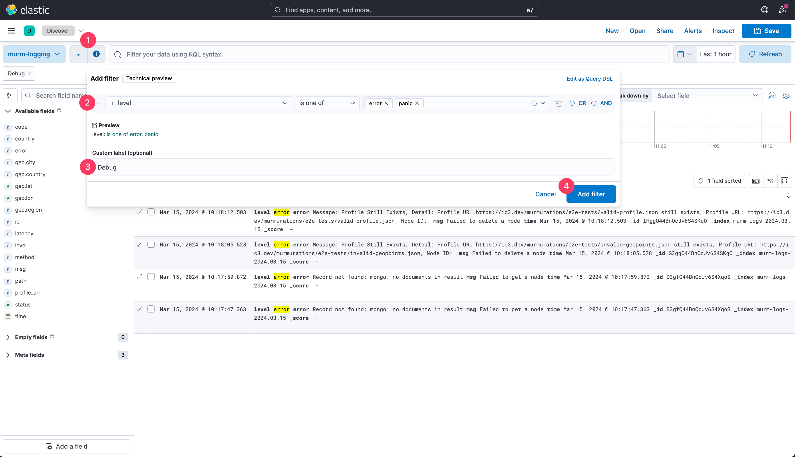
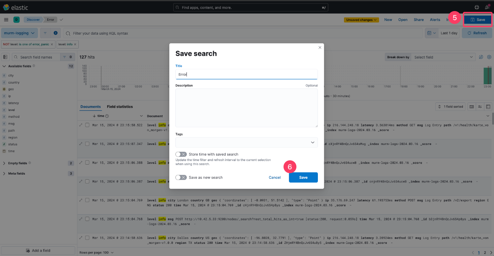
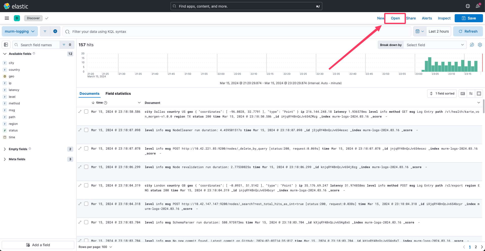
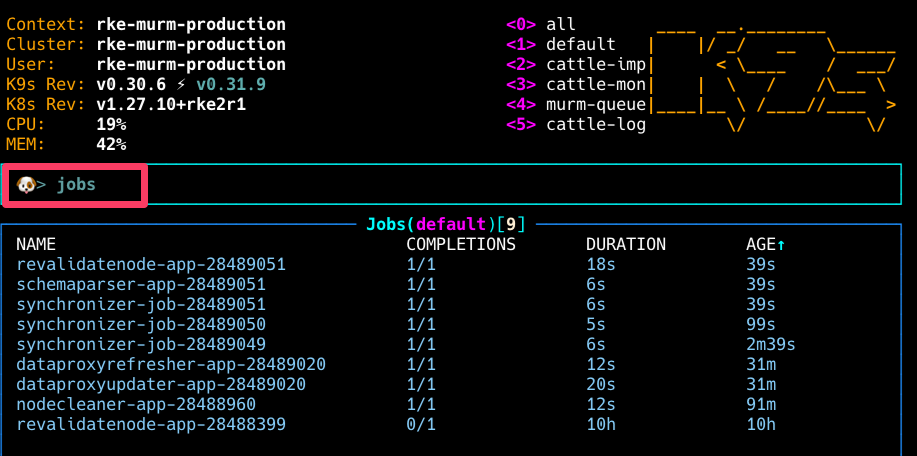
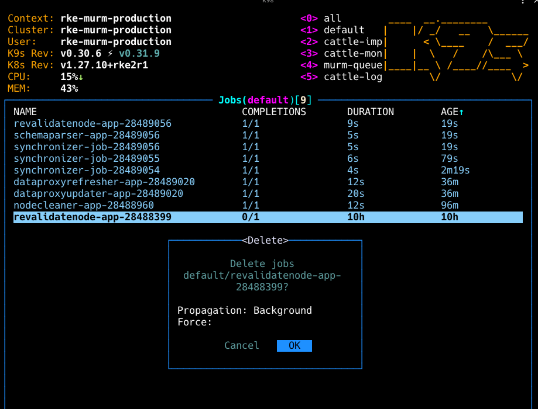
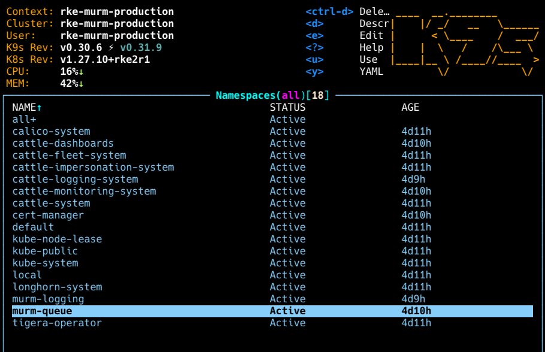
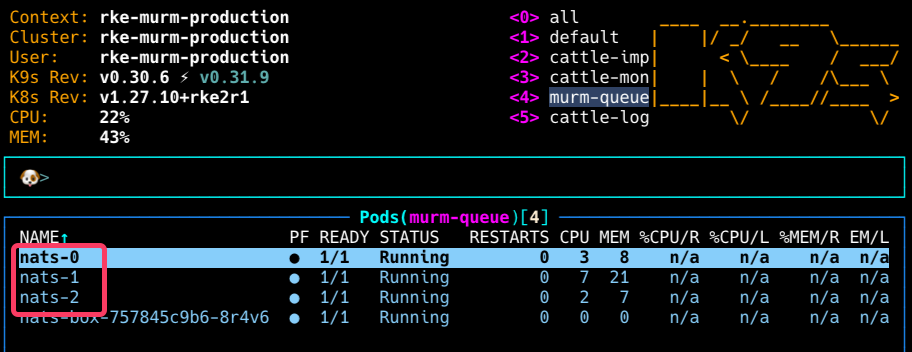

# Debugging Guide

## Table of Contents

- [Manual Intervention for Node Failures](#manual-intervention-for-node-failures)
- [Manual Intervention for Rancher Failure](#manual-intervention-for-rancher-failure)
- [Set Up Kibana Error Filters](#set-up-kibana-error-filters)
- [Fix Failed Jobs](#fix-failed-jobs)
- [Fix Issues with Message Queues](#fix-issues-with-message-queues)

## Manual Intervention for Node Failures

1. **Forcing Pod Recreation on Other Nodes**: When a node fails, some pods may remain in a terminating state indefinitely. To address this, force the scheduler to recreate these pods on other available nodes using the following command:

   ```bash
   kubectl get pods --all-namespaces | grep Terminating | awk '{print $1 " " $2}' | while read ns pod; do kubectl delete pod $pod -n $ns --grace-period=0 --force; done
   ```

   This command identifies all pods that are stuck in a Terminating state across all namespaces and forcefully deletes them, prompting Kubernetes to recreate them on other nodes.

2. **Removing the Unavailable Machine**: Next, navigate to the Rancher UI to remove the node that has become unavailable. Here’s how:

   1. Go to the ☰ menu and select Cluster Management.
   2. Locate the cluster containing the failed node.
   3. Select the node in question and use the option to delete it, removing the unavailable machine from your cluster.

   This step ensures that the cluster's resources are updated and that the failed node is no longer considered part of the cluster.

3. **Adding a New Node Using a Temporary Server**: To maintain the desired capacity of your cluster, you can quickly add a new node using one of the available temporary servers. Following the instruction provided in the [documentation](../rancher/04-setup-rke2-cluster/README.md#step-3---registering-nodes-to-the-cluster), you can add a new node to your cluster and ensure that the applications continue to run smoothly.

## Manual Intervention for Rancher Failure

Please refer to the [Rancher Disaster Recovery](../rancher/03-setup-rancher/disaster-recovery-rancher.md) guide.

## Set Up Kibana Error Filters

If something goes wrong with the servers and you need to check the error logs quickly, setting up a filter in Kibana can save you a lot of time.

Here’s a simple step-by-step guide to make things smoother:

**1. Switch to the Right Context**:

Open your terminal and switch to the correct Kubernetes context with the following command:

```bash
kubectl config use-context <target-k8s-context>
```

**2. Connect Kibana to Port 5601**:

Next, you’ll want to make Kibana accessible on your local machine. Run this command:

```bash
kubectl port-forward -n murm-logging svc/murm-logging-kibana 5601:5601
```

**3. Open Kibana in Your Browser**:

Go to [Kibana discover page](http://localhost:5601/app/discover).

**4. Create a Filter**:

Once you're in, set up a filter. This will help you focus on the specific logs you’re interested in.



**5. Repeat as Needed**:

You can set up multiple filters depending on what you need to monitor. Just repeat the steps above for each new filter.

**6. Save the Search**:

To save your current search results for future reference, click on the upper right corner of the screen. You will be prompted to provide a name for your saved search.



To access your saved searches later, simply click on the "Open" tab.



## Fix Failed Jobs

1. **Check the Namespace**: Use k9s to look at the default namespace. Look for any jobs that didn't work out.

2. **View Job Logs**: To get more info, check the logs of the job that didn't work. In k9s, press `l` to see the logs of what you've selected.

3. **See All Jobs**: In k9s, type `:jobs`. This shows all the jobs so you can see details like their status, how old they are, and more.

    

4. **Remove Old or Failed Jobs**: After finding jobs that are old or didn't succeed, you can get rid of them in k9s. Click on the job and press `command + d`. You'll be asked to confirm that you want to delete it.

    

## Fix Issues with Message Queues

Sometimes, NATS might not work right. If that happens, these steps can help reset everything by removing and letting Kubernetes (k8s) start the stateful sets again.

1. **Go to Namespace**: Use `:namespaces` in k9s to go to the namespace page.
2. **Remove the Message Queue Namespace**: Look for and select the `murm-queue` namespace.

    

3. **Delete Each Stateful Set**: Choose each NATS stateful set one by one and use `command + d` to delete them. You don't need to wait for one to restart before deleting the next.

    
