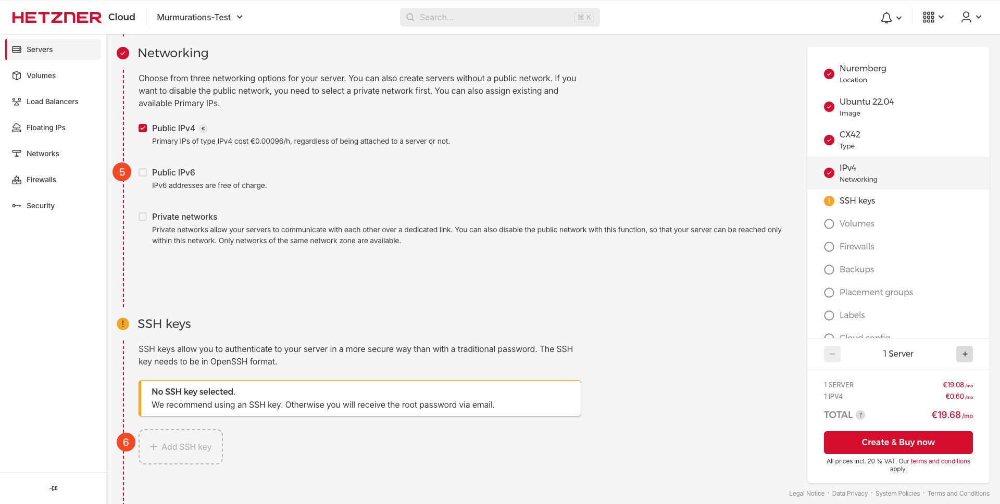
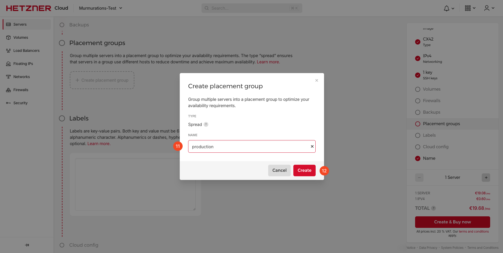
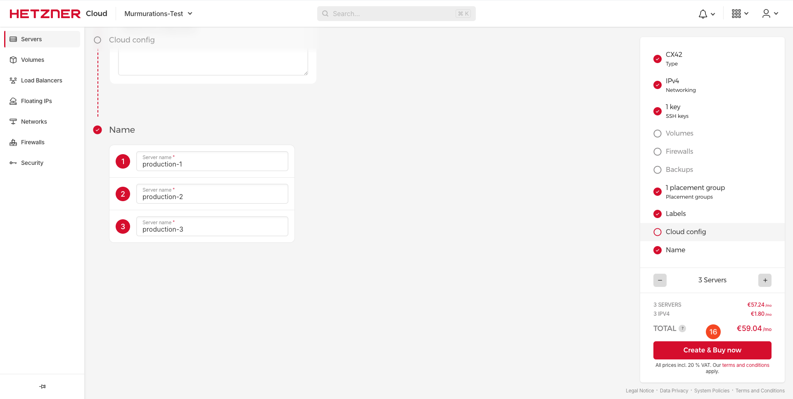

# How to Set Up a Hetzner Server

## Introduction

This guide will demonstrate how to set up a Hetzner server as a Kubernetes node.

## Table of Contents

- [Introduction](#introduction)
- [Step 1 - Creating a Hetzner Server](#step-1---creating-a-hetzner-server)
- [Step 2 - Setting Up Location and Image](#step-2---setting-up-location-and-image)
- [Step 3 - Choose Server Type](#step-3---choose-server-type)
- [Step 4 - Choose Network and SSH Key](#step-4---choose-network-and-ssh-key)
- [Step 5 - Create Placement Group](#step-5---create-placement-group)
- [Step 6 - Create Label](#step-6---create-label)
- [Step 7 - Select Server Amount and Create Server](#step-7---select-server-amount-and-create-server)

## Step 1 - Creating a Hetzner Server

1. Log in to your Hetzner account.
2. Click on the "Servers" tab.
3. Click on the "Add Server" button.

   

## Step 2 - Setting Up Location and Image

1. Choose "Nuremburg" as the location.
2. Choose "Ubuntu 22.04" as the image.

    

## Step 3 - Choose Server Type

1. Choose "x86(Intel/AMD)" as the server type.
2. Choose "CX42" as the server type.

    

## Step 4 - Choose Network and SSH Key

1. Uncheck "Public IPv6".
2. Add your SSH key.

    
    

## Step 5 - Create Placement Group

1. Click on "Create placement group".
2. Name the placement group, create it, and select it.

    
    

## Step 6 - Create Label

1. Type "env=production" in the label field.

    

## Step 7 - Select Server Amount and Create Server

1. Change the name of the server and select the amount of servers you want to create.

    

2. Click on "Create & Buy now".

    
