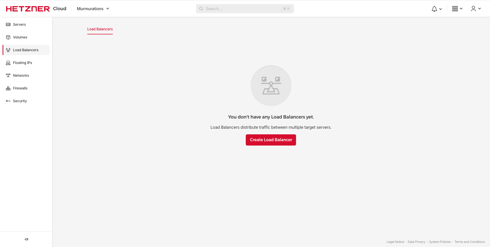
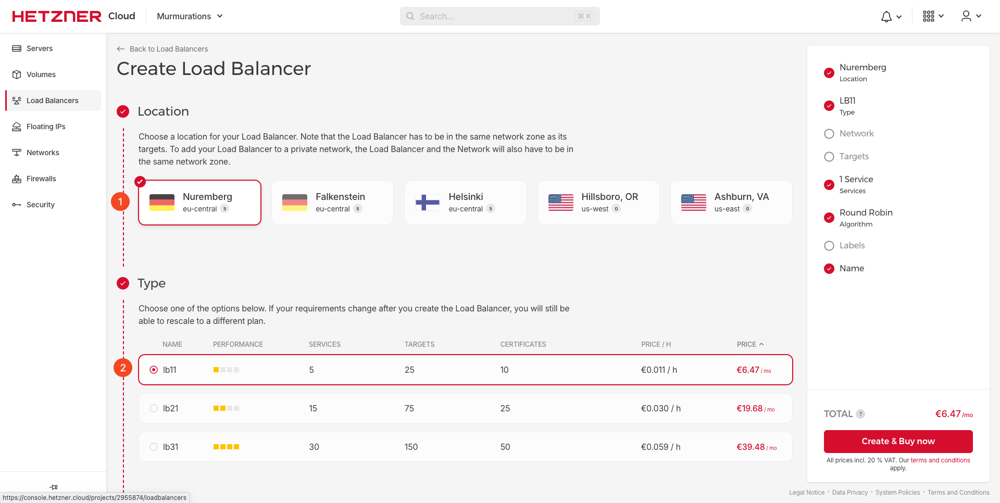
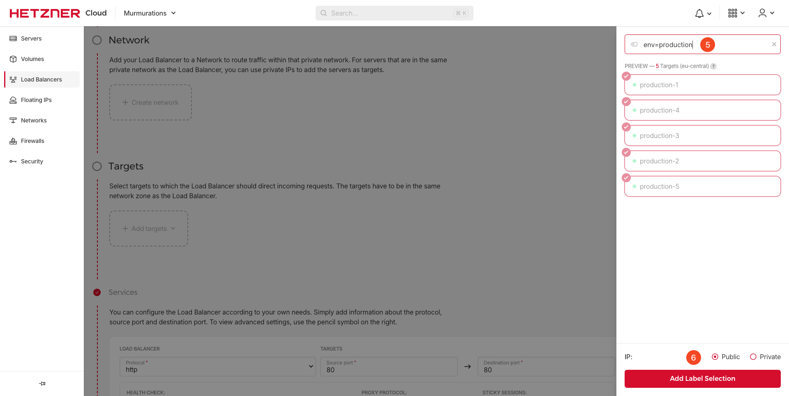
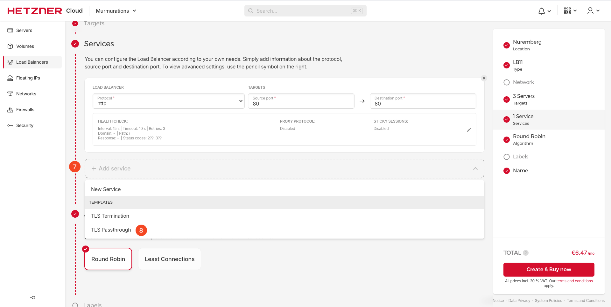
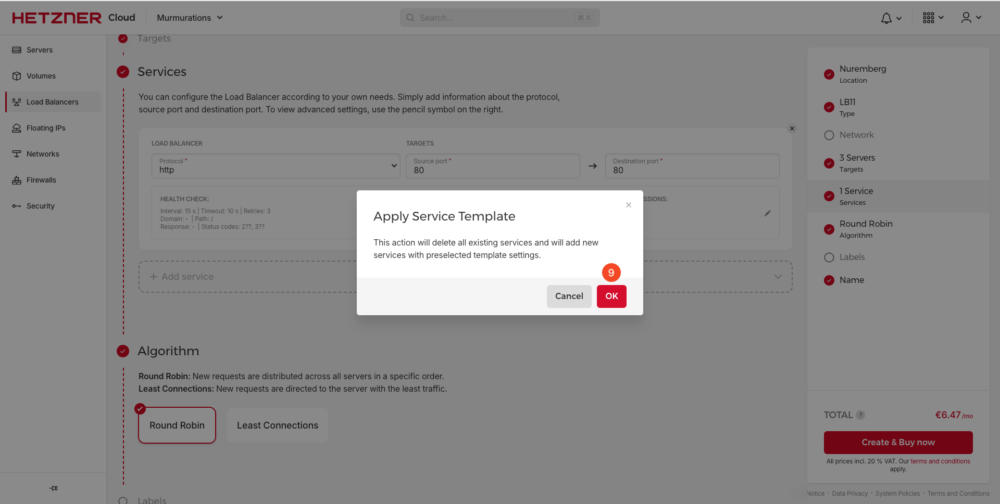
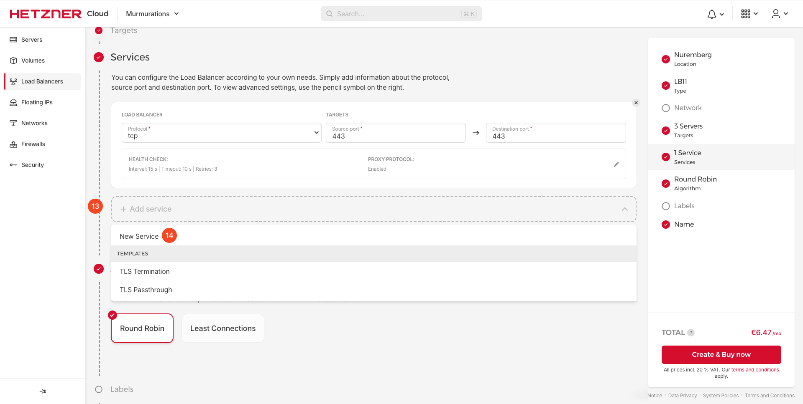
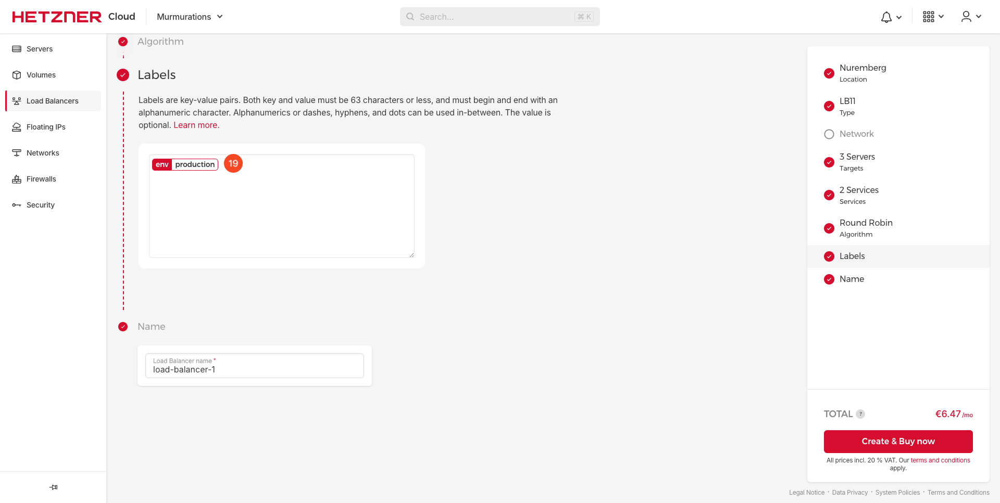

# How to Set Up a Hetzner Load Balancer

## Introduction

This guide will demonstrate how to set up a Hetzner Load Balancer.

## Table of Contents

- [Introduction](#introduction)
- [Step 1 - Creating a Hetzner Load Balancer](#step-1---creating-a-hetzner-load-balancer)
- [Step 2 - Setting Up Location and Type](#step-2---setting-up-location-and-type)
- [Step 3 - Add Target](#step-3--add-target)
- [Step 4 - Update Services](#step-4---update-services)
- [Step 5 - Select Label](#step-5---select-label)
- [Step 6 - Create Load Balancer](#step-6---create-load-balancer)

## Step 1 - Creating a Hetzner Load Balancer

1. Log in to your Hetzner account.
2. Click on the "Load Balancers" tab.
3. Click on the "Create Load Balancer" button.

    

## Step 2 - Setting Up Location and Type

1. Choose "Nuremburg" as the location.
2. Choose "lb11" as the type.

    

## Step 3- Add Target

1. Click on "Add Target".
2. Select "Label" as the target type.

   

3. Type "env=production" in the label field, and click "Add Label Selection".

    

## Step 4 - Update Services

1. Click on "Add Service", and select "TLS Passthrough" as the service type.

    

2. Showing warning message of Apply Service Template, click "OK".

    

3. Edit tcp 443 service, check "Proxy Protocol" and click "OK".

   
   

4. Click on "Add Service", and select "New Service" as the service type.

    

5. Edit http service.

   

6. Change path to `/healthz`, check "Proxy Protocol" and click "OK".

   

## Step 5 - Select Label

1. Type "env=production" in the label field.

    

## Step 6 - Create Load Balancer

1. Change the name of the load balancer.
2. Click on "Create & Buy now".

    
