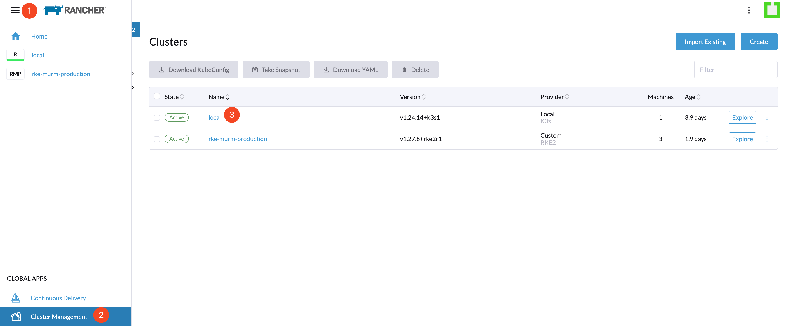
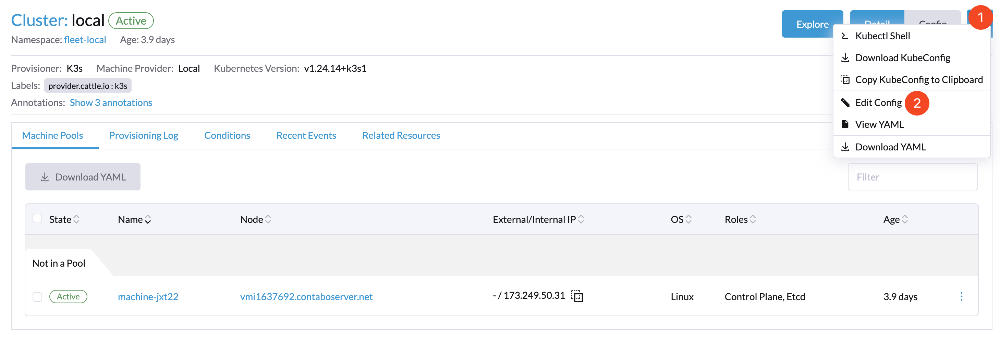
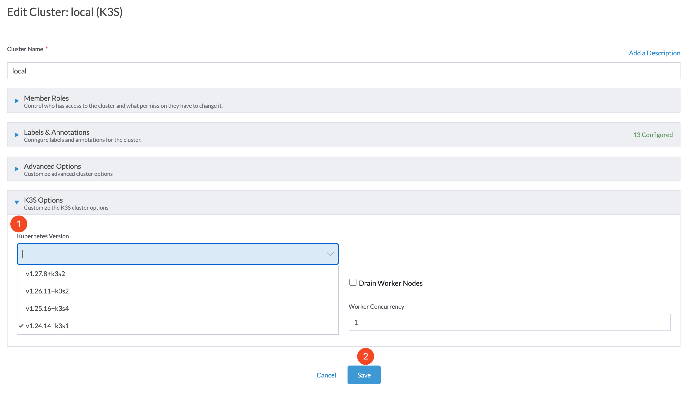

# Upgrading K3s Clusters

## Introduction

This document outlines a structured approach for upgrading K3s. The upgrade process is critical for leveraging the latest features, performance enhancements, and security patches in the K3s ecosystem.

## Table of Contents

- [Introduction](#introduction)
- [Prerequisites](#prerequisites)
- [Step 1 - Accessing Cluster Management](#step-1---accessing-cluster-management)
- [Step 2 - Editing Cluster Configuration](#step-2---editing-cluster-configuration)
- [Step 3 - Updating the K3s Version](#step-3---updating-the-k3s-version)
- [Conclusion](#conclusion)

## Prerequisites

Prior to initiating the upgrade, ensure the following conditions are met:

- You have administrative privileges on the Rancher platform.

## Step 1 - Accessing Cluster Management

Navigate to the **☰** menu in the upper left corner of the Rancher dashboard. Select **Cluster Management** and select **local**.

## Step 2 - Editing Cluster Configuration

In the Clusters section, click on the **...** menu in the upper right corner and choose **Edit Config** to modify cluster settings.

## Step 3 - Updating the K3s Version

Adjust the cluster's configuration as follows:

1. Find the **K3s Version** dropdown menu.
2. Select the K3s version to which you intend to upgrade.
3. Confirm the selection by clicking **Save**, initiating the upgrade process as Rancher applies the new K3s version to your cluster.

## Conclusion

By adhering to these instructions, you can efficiently upgrade the K3s version of your Rancher-managed cluster. This procedure is engineered to be clear and user-friendly, assuring that your clusters remain up-to-date with the most secure and capable version of K3s available. Rancher simplifies the management and upgrading of K3s clusters, enabling you to concentrate on application deployment and management.

Go back to [Home](../README.md).
