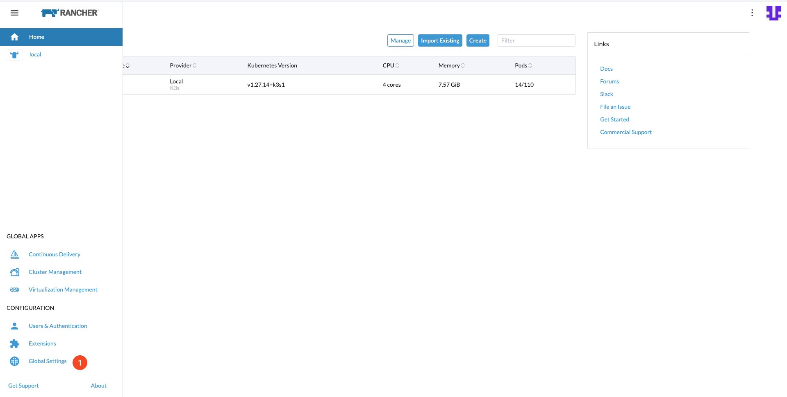
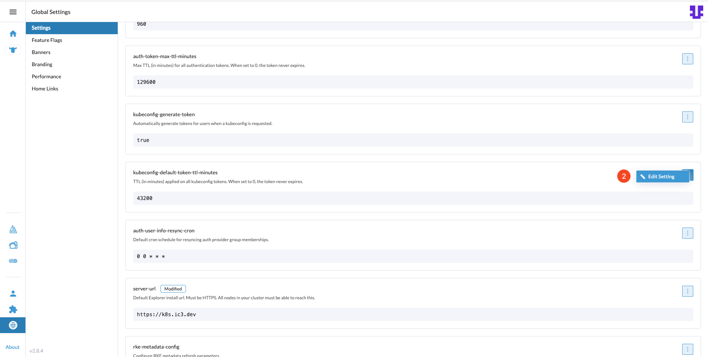
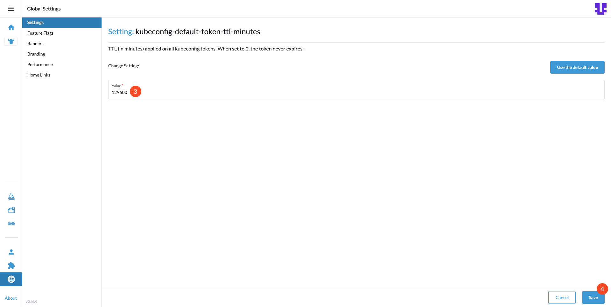

# Setting Up Rancher on k3s

## Introduction

This guide leads you through the deployment of Rancher on a k3s cluster. Rancher is a powerful management platform for Kubernetes, offering an easy-to-use web UI for managing clusters. By the end of this guide, you will have Rancher installed and ready for cluster management on your k3s setup.

After completing this guide, you will have:

- Deployed Rancher on your k3s cluster.

## Table of Contents

- [Introduction](#introduction)
- [Prerequisites](#prerequisites)
- [Step 1 - Setting the Correct kubectl Context](#step-1---setting-the-correct-kubectl-context)
- [Step 2 - Adding Necessary Helm Repositories](#step-2---adding-necessary-helm-repositories)
- [Step 3 - Installing cert-manager](#step-3---installing-cert-manager)
- [Step 4 - Deploying Rancher](#step-4---deploying-rancher)
- [Step 5 - Accessing Rancher](#step-5---accessing-rancher)
- [Step 6 - Configuring kubeconfig Token TTL](#step-6---configuring-kubeconfig-token-ttl)
- [Conclusion](#conclusion)

## Prerequisites

Before you begin, ensure you have:

- A k3s cluster up and running.
- kubectl configured to communicate with your cluster.
- Helm installed and configured on your local machine. For detailed installation instructions, visit the [Helm Installation Guide](https://helm.sh/docs/intro/install/).

## Step 1 - Setting the Correct kubectl Context

It's essential to ensure you're working within the right context to apply all commands to the intended k3s cluster.

```bash
kubectl config use-context k3s-murm-rancher
```

## Step 2 - Adding Necessary Helm Repositories

Helm packages simplify Kubernetes applications' deployment and management. By adding these repositories, you gain access to the stable releases of Rancher and the tools required for certificate management.

```bash
helm repo add rancher-stable https://releases.rancher.com/server-charts/stable
helm repo add jetstack https://charts.jetstack.io
helm repo update
```

- `rancher-stable` contains stable releases of Rancher, allowing you to install the latest supported Rancher version on your cluster.
- `jetstack` provides the cert-manager Helm chart, a prerequisite for managing certificates within Kubernetes environments.

## Step 3 - Installing cert-manager

Cert-manager handles certificate management in Kubernetes, automating certificate issuance and renewal. This step is crucial for securing Rancher with valid SSL certificates.

```bash
helm install cert-manager jetstack/cert-manager \
  --namespace cert-manager \
  --create-namespace \
  --version v1.14.6 \
  --set installCRDs=true
```

Cert-manager is installed in its namespace, ensuring isolation and security. The `installCRDs` option enables the creation of necessary Custom Resource Definitions for certificate management.

## Step 4 - Deploying Rancher

With cert-manager in place, proceed to install Rancher. This step involves configuring Rancher with an initial admin password, hostname, and email for Let's Encrypt certificate notifications.

```bash
helm install rancher rancher-stable/rancher \
  --namespace cattle-system \
  --create-namespace \
  --set replicas=1 \
  --set ingress.tls.source=letsEncrypt \
  --set letsEncrypt.ingress.class=traefik \
  --set hostname={{server_dns_name}} \
  --set bootstrapPassword={{password}} \
  --set letsEncrypt.email={{email}}
```

Ensure to replace `{{server_dns_name}}`, `{{password}}`, and `{{email}}` with your server's DNS name, a secure password for Rancher's admin account, and the email address for Let's Encrypt registration, respectively.

## Step 5 - Accessing Rancher

After the installation completes, access Rancher through the following URL to initialize your setup:

```bash
https://{{server_dns_name}}/dashboard/?setup={{password}}
```

Replace `{{server_dns_name}}` and `{{password}}` with your actual server DNS name and the password you set during the Rancher installation.

## Step 6 - Configuring kubeconfig Token TTL

To prevent the kubeconfig from expiring too quickly, it's essential to adjust the default token TTL (Time-To-Live) settings. We'll change the kubeconfig-default-token-ttl-minutes setting to 129600 minutes, which equals 90 days. Follow these steps to update the token TTL:

1. In the bottom right corner, click on the Global Settings.

    

2. Locate the `kubeconfig-default-token-ttl-minutes` setting, and click on the Edit Setting button.

    

3. Change the Value to 129600 to set the TTL to 90 days, and click Save to apply the change.

    

## Conclusion

Following these steps, Rancher is now deployed on your k3s cluster. You can manage your Kubernetes clusters through Rancher's intuitive web interface, streamlining the deployment and management of your applications.

Go to Section 4 - [Set up RKE2](../04-setup-rke2-cluster/README.md).
