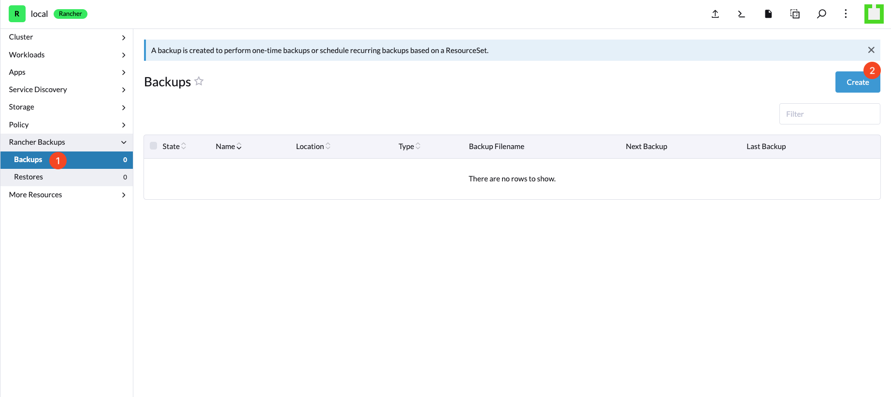
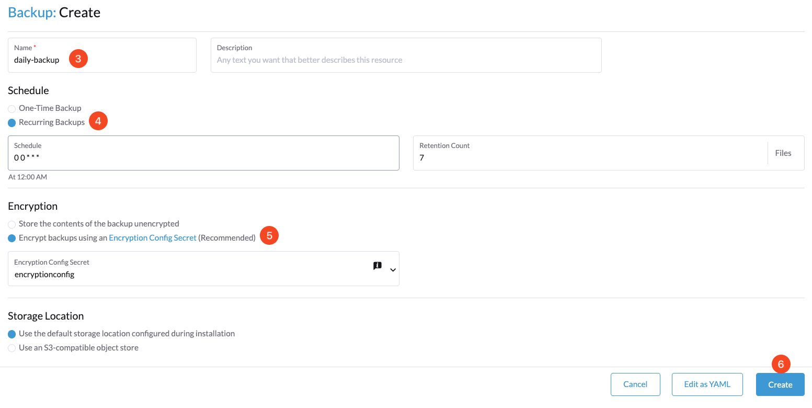
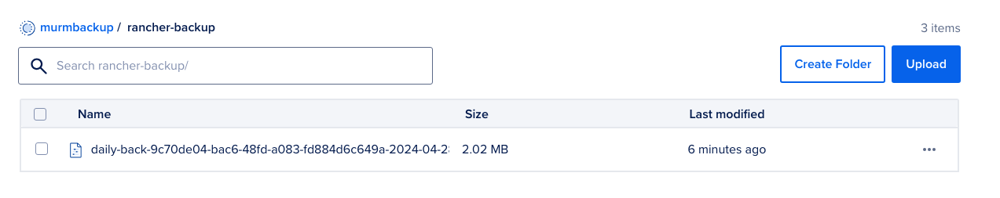

# Back Up Rancher

## Introduction

This document serves as a comprehensive guide to effectively back up your Rancher instance.

## Table of Contents

- [Introduction](#introduction)
- [Prerequisites](#prerequisites)
- [Step 1 - Switching to the K3s Cluster](#step-1---switching-to-the-k3s-cluster)
- [Step 2 - Generating a 32-Byte Encryption Key](#step-2---generating-a-32-byte-encryption-key)
- [Step 3 - Creating the Encryption Provider Configuration File](#step-3---creating-the-encryption-provider-configuration-file)
- [Step 4 - Applying the Encryption Configuration](#step-4---applying-the-encryption-configuration)
- [Step 5 - Navigating to the Rancher Backup Page](#step-5---navigating-to-the-rancher-backup-page)
- [Step 6 - Configuring and Initiating a Backup](#step-6---configuring-and-initiating-a-backup)
- [Step 7 - Verifying Backup at the Storage Location](#step-7---verifying-backup-at-the-storage-location)
- [Conclusion](#conclusion)

## Prerequisites

Before commencing the backup process, ensure you meet the following conditions:

- The Rancher Backup Tool is installed. See [Installing the Rancher Backup Tool](./install-rancher-backup-tool.md) for guidance.

## Step 1 - Switching to the K3s Cluster

Switch to the K3s cluster context where Rancher is running using the following command:

```bash
kubectl config use-context k3s-my-rancher
```

## Step 2 - Generating a 32-Byte Encryption Key

Generate a secure 32-byte encryption key with:

```bash
openssl rand -base64 32
```

Securely store this key in a safe location, such as a password manager. This will be needed if you are restoring from a new Rancher cluster.

## Step 3 - Creating the Encryption Provider Configuration File

1. Navigate to your preferred working directory.
2. Create a new file named `encryption-provider-config.yaml`.
3. Open the file in an editor and insert the following configuration, replacing `{{base64-encoded-secret}}` with your previously generated key:

```yaml
apiVersion: apiserver.config.k8s.io/v1
kind: EncryptionConfiguration
resources:
    - resources:
        - secrets
    providers:
        - aescbc:
            keys:
            - name: key1
                secret: {{base64-encoded-secret}}
        - identity: {}
```

Example commands for creating and editing the file:

```bash
cd ~/desktop
touch encryption-provider-config.yaml
vim encryption-provider-config.yaml
```

## Step 4 - Applying the Encryption Configuration

Create a Kubernetes secret in the `cattle-resources-system` namespace with your encryption configuration using:

```bash
kubectl create secret generic encryptionconfig \
  --from-file=./encryption-provider-config.yaml \
  -n cattle-resources-system
```

## Step 5 - Navigating to the Rancher Backup Page

Proceed to the Rancher dashboard and locate the Backup page within the Tools section to set up your backup.



## Step 6 - Configuring and Initiating a Backup

Set up your backup with the following settings:

- **Name:** e.g., `daily-backup`.
- **Recurring Backups:** Set a schedule, such as `0 0 * * *` for daily backups at midnight.
- **Retention Count:** Decide on the number of backups to keep, e.g., `7`.
- **Encryption:** Encrypt backups using an Encryption Config Secret.
- **Storage Location:** Use the default or specify as required.



## Step 7 - Verifying Backup at the Storage Location

After initiating the backup, ensure its successful creation and integrity at your chosen storage location.




## Conclusion

This step-by-step guide ensures that your Rancher instance is backed up securely and efficiently. Regular review and testing of your backup and restore procedures are essential for maintaining operational resilience.

Go back to [Home](../README.md).
