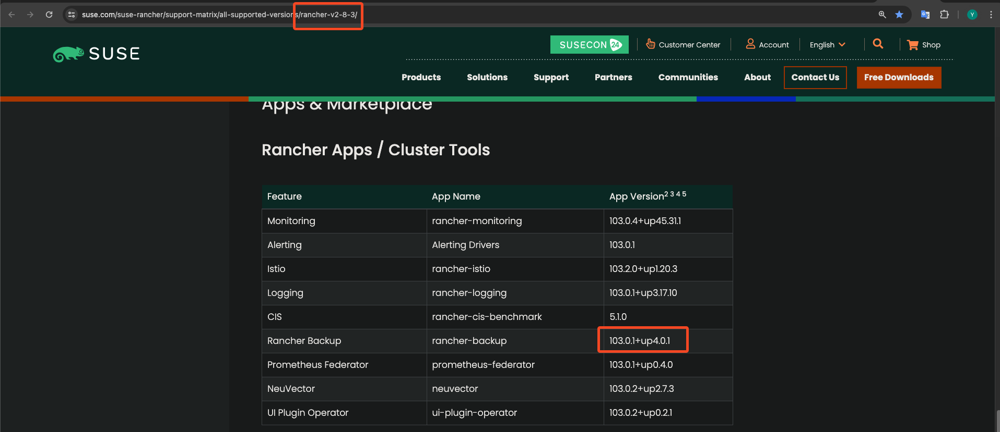

# Rancher Disaster Recovery

## Introduction

This document offers a detailed guide on how to restore your Rancher deployment to a new cluster if the original node running Rancher fails.

## Table of Contents

- [Introduction](#introduction)
- [Prerequisites](#prerequisites)
- [Step 1 - Switch to the k3s cluster](#step-1---switch-to-the-k3s-cluster)
- [Step 2 - Install the rancher-backup Helm chart](#step-2---install-the-rancher-backup-helm-chart)
- [Step 3 - Restore from backup using a Restore custom resource](#step-3---restore-from-backup-using-a-restore-custom-resource)
- [Step 4 - Follow the Setting Up Rancher on k3s Guide](#step-4---follow-the-setting-up-rancher-on-k3s-guide)
- [Conclusion](#conclusion)

## Prerequisites

Before beginning the restoration process, ensure you have:

- A newly set up server following the [Setup Ubuntu](../01-setup-ubuntu/README.md) guide.
- A backup file ready for restoration. Check the DigitalOcean space.

## Step 1 - Switch to the k3s cluster

It's essential to ensure you're working within the right context to apply all commands to the intended **k3s cluster**.

```bash
kubectl config use-context {{k3s-murm-rancher}}
```

## Step 2 - Install the rancher-backup Helm chart

### 1. Add the Helm repository

```bash
helm repo add rancher-charts https://charts.rancher.io
helm repo update
```

### 2. Set a `CHART_VERSION` variable

Refer to the [support matrix](https://www.suse.com/suse-rancher/support-matrix/all-supported-versions/rancher-v2-8-3/) under the Rancher Apps / Cluster Tools section to determine which rancher-backup versions are compatible. For instance, if you are using Rancher version `v2.8.3`, you should set the chart version to `103.0.1+up4.0.1`.



```bash
CHART_VERSION={{chart-version}}
```

### 3. Install the charts

```bash
helm install rancher-backup-crd rancher-charts/rancher-backup-crd -n cattle-resources-system --create-namespace --version $CHART_VERSION
helm install rancher-backup rancher-charts/rancher-backup -n cattle-resources-system --version $CHART_VERSION
```

## Step 3 - Restore from backup using a Restore custom resource

### 1. Create a `Secret` object that stores Ocean Space credentials

```bash
kubectl create secret generic do-space-creds \
  --from-literal=accessKey={{access key}} \
  --from-literal=secretKey={{secret key}}
```

### 2. Create an encryption configuration

Create an `encryption-provider-config.yaml` file to decrypt the backup file. Replace the `{{base64-encoded-secret}}` with the one you created before when backing up Rancher.

```yaml
# encryption-provider-config.yaml
apiVersion: apiserver.config.k8s.io/v1
kind: EncryptionConfiguration
resources:
  - resources:
      - secrets
    providers:
      - aescbc:
          keys:
            - name: key1
              secret: {{base64-encoded-secret}}
      - identity: {}
```

Apply the following command to create the encryption config secret:

```bash
kubectl create secret generic encryptionconfig \
  --from-file=./encryption-provider-config.yaml \
  -n cattle-resources-system
```

### 3. Create a Restore object

```yaml
# restore-migration.yaml
apiVersion: resources.cattle.io/v1
kind: Restore
metadata:
  name: restore-migration
spec:
  backupFilename: {{backup-file-name-from-do}} # daily-back-9c70de04-bac6-....tar.gz.enc
  prune: false
  encryptionConfigSecretName: encryptionconfig
  storageLocation:
    s3:
      credentialSecretName: do-space-creds
      credentialSecretNamespace: default
      bucketName: {{do-space-name}}    # murmbackup
      folder: {{do-space-folder-name}} # rancher-backup
      region: ams3
      endpoint: ams3.digitaloceanspaces.com
```

### 4. Apply the manifest, and monitor the Restore status

Apply the Restore object resource:

```bash
kubectl apply -f restore-migration.yaml
```

Watch the Restore status:

```bash
kubectl get restore
```

Watch the restoration logs:

```bash
kubectl logs -n cattle-resources-system --tail 100 -f -l app.kubernetes.io/instance=rancher-backup
```

Once the Restore resource has the status "Completed", you can continue with the cert-manager and Rancher installation.

## Step 4 - Follow the Setting Up Rancher on k3s Guide

Now you can follow the [Setting Up Rancher on k3s Guide](./README.md) to install Rancher and it will automatically restore to the backup version.

## Conclusion

This guide outlines essential steps to efficiently restore your Rancher deployment and ensure minimal downtime.

Go back to [Home](../README.md).
