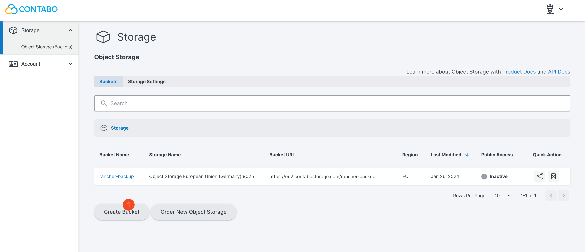
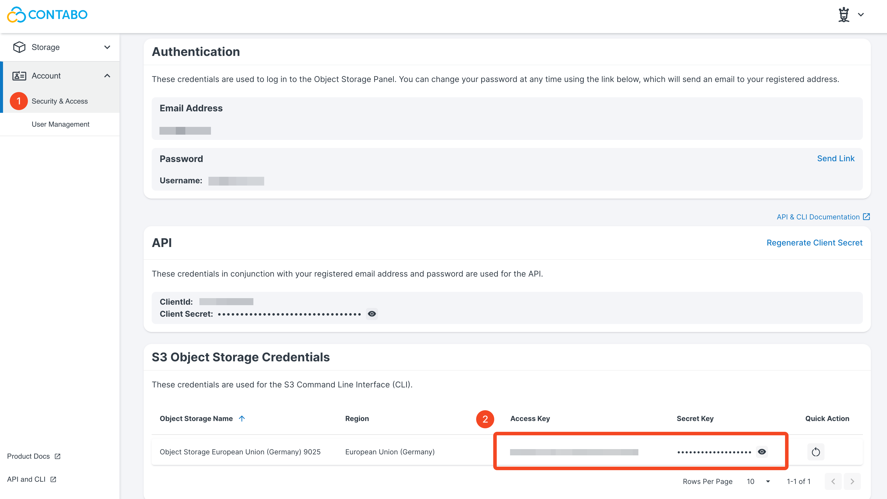
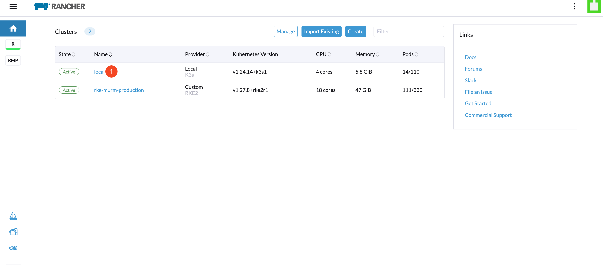
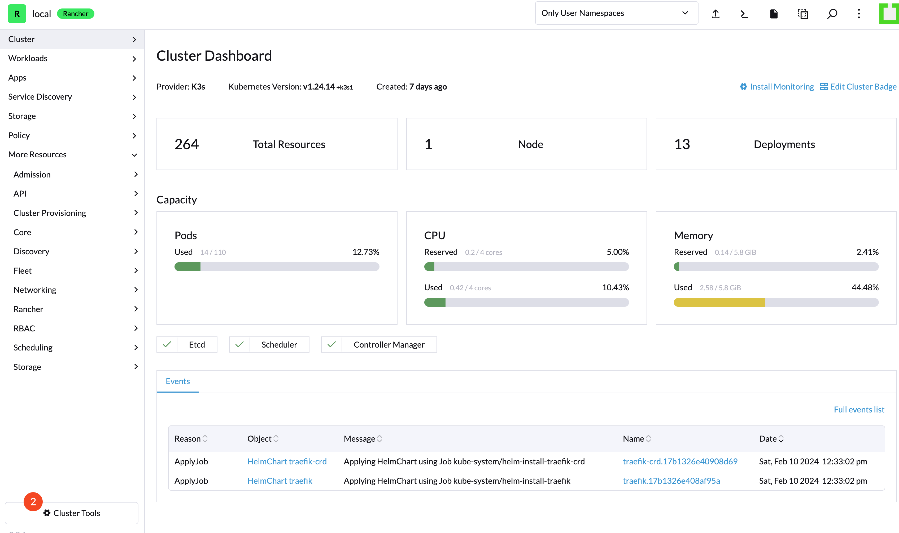
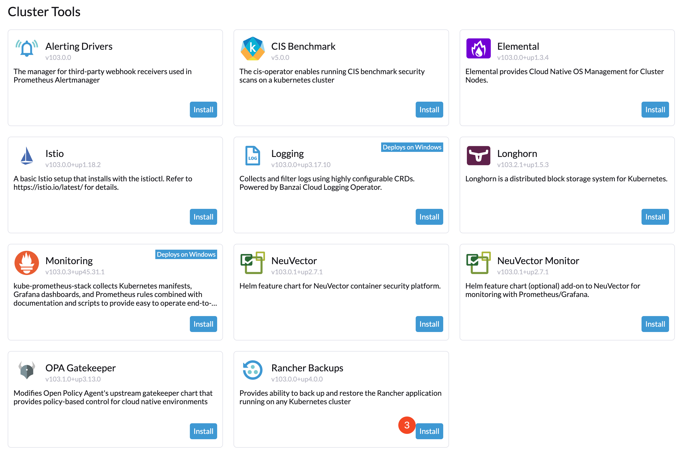
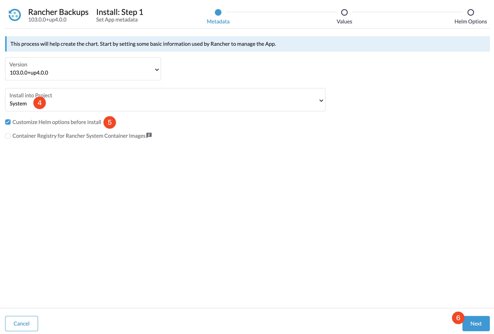
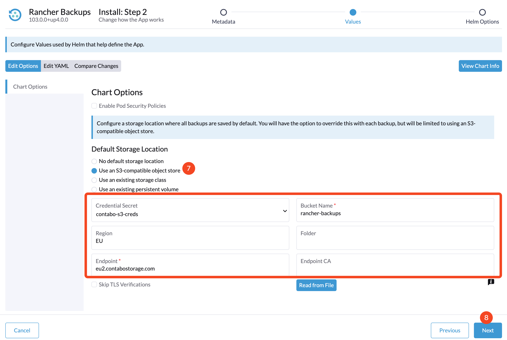
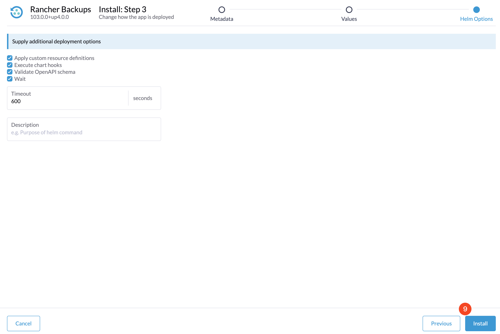

# Installing the Rancher Backup Tool

## Introduction

This guide outlines the process for installing the Rancher Backup tool with Contabo Object Storage.

## Table of Contents

- [Introduction](#introduction)
- [Prerequisites](#prerequisites)
- [Step 1 - Creating a Bucket in Contabo Object Storage](#step-1---creating-a-bucket-in-contabo-object-storage)
- [Step 2 - Obtaining S3 Object Storage Credentials](#step-2---obtaining-s3-object-storage-credentials)
- [Step 3 - Switching Kubectl Context](#step-3---switching-kubectl-context)
- [Step 4 - Creating Secrets in K3s](#step-4---creating-secrets-in-k3s)
- [Step 5 - Installing Rancher Backup](#step-5---installing-rancher-backup)
- [Step 6 - Configuring the Backup Tool](#step-6---configuring-the-backup-tool)
- [Step 7 - Finalizing the Installation](#step-7---finalizing-the-installation)
- [Conclusion](#conclusion)

## Prerequisites

Ensure the availability of the following before beginning:

- A Contabo account with Object Storage service.
- Administrative access to your Rancher dashboard.
- A K3s cluster with `kubectl` configured.

## Step 1 - Creating a Bucket in Contabo Object Storage

Navigate to the Contabo Object Storage section to set up a new storage bucket for storing Rancher backups. Access the Object Storage panel:



Then, proceed to create a new bucket by clicking on "Create Bucket" and specifying the required bucket name, region, and storage class.


## Step 2 - Obtaining S3 Object Storage Credentials

Following the bucket creation, it's necessary to retrieve your S3-compatible storage credentials, including the Access Key and Secret Key. This can be done by going to the "Account" section within the Contabo panel and locating your credentials under "S3 Object Storage Credentials."



## Step 3 - Switching Kubectl Context

Before creating secrets in K3s, switch the `kubectl` configuration context to the intended K3s cluster using the following command:

```shell
kubectl config use-context k3s-murm-rancher
```

## Step 4 - Creating Secrets in K3s

After switching the context, proceed to create a Kubernetes secret in your cluster using the obtained credentials. This is done by executing a command to create a generic secret named `contabo-s3-creds`, incorporating your access and secret keys.

```shell
kubectl create secret generic contabo-s3-creds \
  --from-literal=accessKey=<access key> \
  --from-literal=secretKey=<secret key>
```

## Step 5 - Installing Rancher Backup

To install the Rancher Backup tool, access the Rancher dashboard and select the k3s cluster where the backup tool will be installed.



From the Rancher main page, navigate to "Cluster Tools" within the sidebar and find "Rancher Backup" in the list of available tools.




## Step 6 - Configuring the Backup Tool

Customize the installation to fit your backup requirements and environment. Start by selecting the project for deployment and click on "Customize Helm options before install" for more detailed settings.



Ensure the default storage location is the S3-compatible object store, select the created secret from step 4, and enter the bucket name, region, and endpoint details as shown.



```text
Credential secret: contabo-s3-creds
Bucket name: rancher-backup
Region: EU
Endpoint: eu2.contabostorage.com
```

## Step 7 - Finalizing the Installation

Finalize the installation process, as depicted in the final image.



## Conclusion

You have successfully configured the Rancher Backup tool with Contabo Object Storage. 
