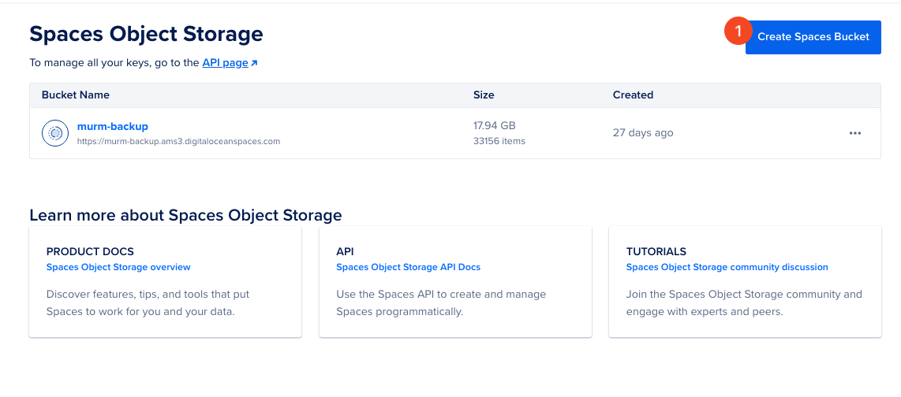
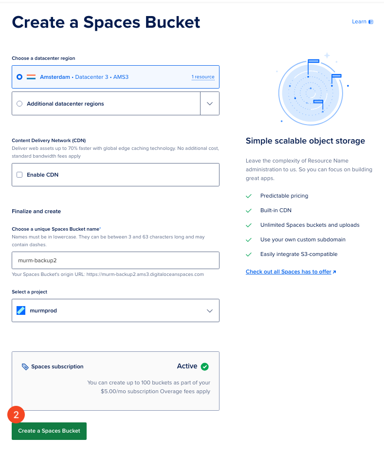

# Install the Rancher Backup Tool

## Introduction

This guide outlines the process for installing the Rancher Backup tool using Digital Ocean Spaces Object Storage.

## Table of Contents

- [Introduction](#introduction)
- [Prerequisites](#prerequisites)
- [Step 1 - Creating a Space in Digital Ocean Spaces Object Storage](#step-1---creating-a-space-in-digital-ocean-spaces-object-storage)
- [Step 2 - Obtaining Digital Ocean Object Storage Credentials](#step-2---obtaining-digital-ocean-object-storage-credentials)
- [Step 3 - Switching Kubectl Context](#step-3---switching-kubectl-context)
- [Step 4 - Creating Secrets in K3s](#step-4---creating-secrets-in-k3s)
- [Step 5 - Installing Rancher Backup](#step-5---installing-rancher-backup)
- [Step 6 - Configuring the Backup Tool](#step-6---configuring-the-backup-tool)
- [Step 7 - Finalizing the Installation](#step-7---finalizing-the-installation)
- [Conclusion](#conclusion)

## Prerequisites

Ensure the availability of the following before beginning:

- A Digital Ocean account with Spaces Object Storage enabled.
- Administrative access to your Rancher dashboard.
- A K3s cluster with `kubectl` configured.

## Step 1 - Creating a Space in Digital Ocean Spaces Object Storage

Navigate to the Digital Ocean Spaces Object Storage section to set up a new space for storing Rancher backups. Access the Object Storage panel:



Then, proceed to create a new space by clicking on "Create Space" and specifying the required space name.



## Step 2 - Obtaining Digital Ocean Object Storage Credentials

After setting up the space, you need to obtain your S3-compatible storage credentials, which include the Access Key and Secret Key. To do this, navigate to the "API" section and select "Generate New Key" under the Space Keys tab.


## Step 3 - Switching Kubectl Context

Before creating secrets in K3s, switch the `kubectl` configuration context to the intended K3s cluster using the following command:

```shell
kubectl config use-context k3s-murm-rancher
```

## Step 4 - Creating Secrets in K3s

After switching the context, proceed to create a Kubernetes secret in your cluster using the obtained credentials. This is done by executing a command to create a generic secret named `do-space-creds`, incorporating your access and secret keys.

```shell
kubectl create secret generic do-space-creds \
  --from-literal=accessKey={{access key}} \
  --from-literal=secretKey={{secret key}}
```

## Step 5 - Installing Rancher Backup

To install the Rancher Backup tool, access the Rancher dashboard and select the k3s cluster where the backup tool will be installed.


From the Rancher main page, navigate to "Cluster Tools" within the sidebar and find "Rancher Backup" in the list of available tools.


## Step 6 - Configuring the Backup Tool

Customize the installation to fit your backup requirements and environment.

Start by selecting the project for deployment and click on "Customize Helm options before install" for more detailed settings.


Ensure the default storage location is set to the S3-compatible object store, select the created secret from step 4, and enter the space name, region, and endpoint details as shown.

```yaml
Credential secret: do-space-creds
Space name: {{space-name}}
Region: ams3
Folder: rancher-backup
Endpoint: ams3.digitaloceanspaces.com
```

## Step 7 - Finalizing the Installation

Finalize the installation process, as depicted in the final image.


## Conclusion

You have successfully configured the Rancher Backup tool with Contabo Object Storage.

Go back to [Backup Rancher](./backup-rancher.md).
