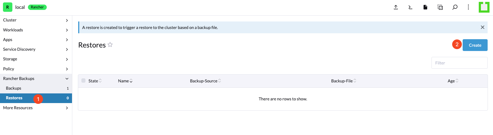
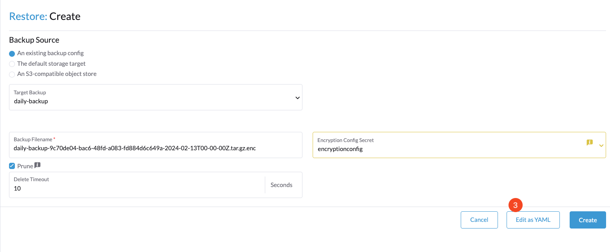

# Restore Rancher

## Introduction

This document provides a detailed guide on how to restore your Rancher deployment.

## Table of Contents

- [Introduction](#introduction)
- [Prerequisites](#prerequisites)
- [Step 1 - Navigate to the Rancher Dashboard](#step-1---navigate-to-the-rancher-dashboard)
- [Step 2 - Create Encryption Configuration](#step-2---create-encryption-configuration)
- [Step 3 - Navigate to the Rancher Dashboard](#step-3---navigate-to-the-rancher-dashboard)
- [Step 4 - Executing the Restore](#step-4---executing-the-restore)
- [Step 5 - Monitoring Restore Progress](#step-5---monitoring-restore-progress)
- [Conclusion](#conclusion)

## Prerequisites

Before beginning the restoration process, ensure you have:

- Administrative access to the Rancher dashboard.
- A backup file ready for restoration. Check the digital ocean space.
- Make sure the [Rancher Backup Tool](./install-rancher-backup-tool.md) is installed.

## Step 1 - Navigate to the Rancher Dashboard

```bash
kubectl config use-context {{new-rancher-context}}
```

## Step 2 - Create Encryption Configuration

Create an `encryption-provider-config.yaml` file to decrypt the backup file. Replace the `{{base64-encoded-secret}}` with the one you created before.

```yaml
apiVersion: apiserver.config.k8s.io/v1
kind: EncryptionConfiguration
resources:
  - resources:
      - secrets
    providers:
      - aescbc:
          keys:
            - name: key1
              secret: {{base64-encoded-secret}}
      - identity: {}
```

Apply the following command to create the encryption config secret:

```bash
kubectl create secret generic encryptionconfig \
  --from-file=./encryption-provider-config.yaml \
  -n cattle-resources-system
```

## Step 3 - Navigate to the Rancher Dashboard

Access the Rancher dashboard and locate the **Rancher Backups > Restores** section from the left navigation bar to manage and initiate restoration processes.



## Step 4 - Executing the Restore

Select **Edit as YAML** and enter the following Restore YAML configuration:



```yaml
apiVersion: resources.cattle.io/v1
kind: Restore
metadata:
  name: restore-migration
spec:
  backupFilename: {{backup file name}}
  encryptionConfigSecretName: encryptionconfig
  storageLocation:
    s3:
      credentialSecretName: do-space-creds
      credentialSecretNamespace: default
      bucketName: {{do space name}}
      region: ams3
      endpoint: ams3.digitaloceanspaces.com
```

## Step 5 - Monitoring Restore Progress

To monitor the restoration progress, run the following command to check the logs of the backup operator:

```bash
kubectl config use-context {{new-rancher-context}}
kubectl logs -n cattle-resources-system -l app.kubernetes.io/name=rancher-backup -f
```

This command provides real-time insights into the restoration process.

## Conclusion

Following this guide ensures a structured and efficient approach to restoring your Rancher-managed Kubernetes environments.

Go back to [Home](../README.md).
