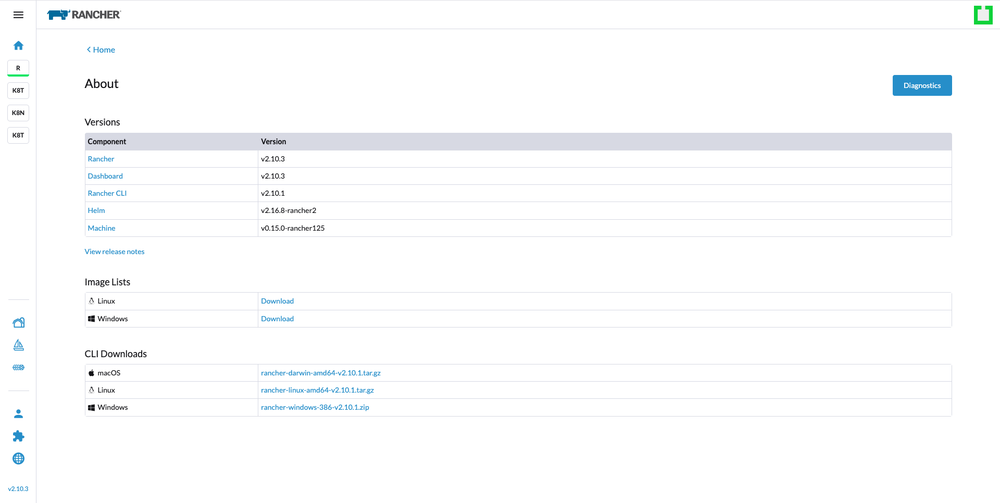

# Upgrade Rancher

## Introduction

This guide provides a comprehensive walkthrough for upgrading Rancher on your existing Kubernetes cluster. Upgrading Rancher is a critical step to ensure you benefit from the latest features, security updates, and bug fixes. By following this guide, you will safely upgrade Rancher to the desired version with minimal disruption to your current setup.

## Table of Contents

- [Introduction](#introduction)
- [Prerequisites](#prerequisites)
- [Step 1 - Changing to the Correct Cluster Context](#step-1---changing-to-the-correct-cluster-context)
- [Step 2 - Refreshing Your Helm Repository](#step-2---refreshing-your-helm-repository)
- [Step 3 - Identifying the Rancher Installation Repository](#step-3---identifying-the-rancher-installation-repository)
- [Step 4 - Downloading the Latest Rancher Chart](#step-4---downloading-the-latest-rancher-chart)
- [Step 5 - Saving Current Settings](#step-5---saving-current-settings)
- [Step 6 - Viewing Available Charts and Versions](#step-6---viewing-available-charts-and-versions)
- [Step 7 - Upgrading Rancher](#step-7---upgrading-rancher)
- [Step 8 - Resolving Version Inconsistency Issues](#step-8---resolving-version-inconsistency-issues)
- [Conclusion](#conclusion)

## Prerequisites

Before proceeding with the upgrade, ensure you have:

- Administrative access to the Kubernetes cluster where Rancher is installed.
- The `kubectl` tool configured to communicate with your cluster.
- Back up the Rancher cluster. For details, you can follow [Backing Up Rancher](./backup-rancher.md).
- Helm installed and configured on your machine.

## Step 1 - Changing to the Correct Cluster Context

Switch to the cluster context where Rancher is installed to apply the upgrade commands correctly.

```bash
kubectl config use-context [context-name]
```

## Step 2 - Refreshing Your Helm Repository

Ensure your Helm repository is up-to-date to fetch the latest Rancher chart.

```bash
helm repo update
```

## Step 3 - Identifying the Rancher Installation Repository

Add the Rancher stable repository if not already present. This repository contains the latest official releases of Rancher.

```bash
helm repo add rancher-stable https://releases.rancher.com/server-charts/stable
```

## Step 4 - Downloading the Latest Rancher Chart

Fetch the latest Rancher chart from the Helm repository to your local machine.

```bash
helm fetch rancher-stable/rancher
```

## Step 5 - Saving Current Settings

Export the current Rancher settings to a YAML file. This step is crucial for retaining your configurations after the upgrade.

```bash
helm get values rancher -n cattle-system -o yaml > values.yaml
```

## Step 6 - Viewing Available Charts and Versions

Check for available Rancher chart versions to determine which version you wish to upgrade to.

```bash
helm search repo rancher-stable/rancher --versions | sort -r | head -n 5
```

## Step 7 - Upgrading Rancher

Upgrade Rancher to a version that suits your environment and needs. Ensure to replace `{{desired_version}}` with the specific version number of Rancher you intend to upgrade to.

```bash
helm upgrade rancher rancher-stable/rancher \
  --namespace cattle-system \
  -f values.yaml \
  --version={{desired_version}}
```

## Step 8 - Resolving Version Inconsistency Issue

After upgrading Rancher, you may encounter a version inconsistency issue where only the Dashboard shows the latest version while other components remain on the previous version.

1. Navigate to the Rancher About page in your browser:

   ```bash
   https://<RANCHER_URL>/dashboard/about
   ```

2. You will notice that only the Dashboard has been upgraded to the latest version, while other components may still show the previous version.

    

3. To resolve this issue, you need to delete the current server-version setting and restart the Rancher deployment.

4. Delete the existing server-version setting:

   ```bash
   kubectl delete settings.management.cattle.io server-version
   ```

5. Restart the Rancher deployment to regenerate the server-version configuration:

   ```bash
   kubectl rollout restart deployment rancher -n cattle-system
   ```

6. Once the restart is complete, navigate back to the About page (https://<RANCHER_URL>/dashboard/about) to confirm that all components now show the consistent upgraded version.

    

## Conclusion

Following these steps will upgrade Rancher to the specified version on your Kubernetes cluster. After the upgrade, you will enjoy the latest features and improvements available in Rancher. It is advisable to check the Rancher documentation for any post-upgrade actions or changes.

Go back to [Home](../README.md).
