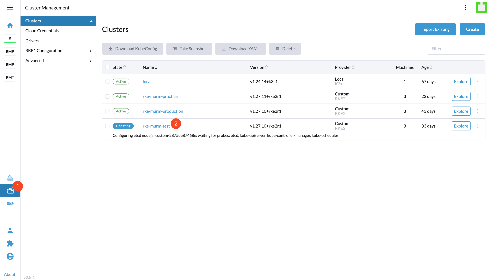
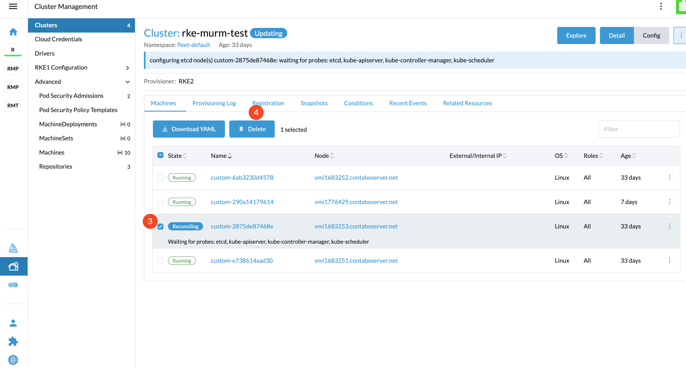

# Manage Cluster Nodes

## Introduction

This guide outlines the management of cluster nodes within Rancher. By following the document, you can effectively add and remove nodes.

## Table of Contents

- [Introduction](#introduction)
- [Prerequisites](#prerequisites)
- [Step 1 - Update the Load Balancer](#step-1---update-the-load-balancer)
- [Step 2 - Select Cluster](#step-2---select-cluster)
- [Step 3 - Go to Nodes Page](#step-3---go-to-nodes-page)
- [Step 4 - Select and Drain Nodes](#step-4---select-and-drain-nodes)
- [Step 5 - Remove Drained Nodes](#step-5---remove-drained-nodes)
- [Step 6 - Remove Nodes from Cluster Management Page](#step-6---remove-nodes-from-cluster-management-page)
- [Step 7 - Rename Servers Accordingly](#step-7---rename-servers-accordingly)
- [Conclusion](#conclusion)

## Prerequisites

**Important**: Before starting, you must add an equal number of new nodes to your cluster as the ones you plan to drain. This step is critical to keep the total number of nodes unchanged, ensuring the stability and capacity of your cluster are maintained. To add nodes to your cluster, please follow this [guide](./README.md#step-3---registering-nodes-to-the-cluster).

## Step 1 - Update the Load Balancer

Before removing nodes, it is essential to update the load balancer configuration to prevent routing issues.

**First, Connect to the Server**
Use SSH to connect to the server hosting the Nginx load balancer:

```sh
ssh root@{{your_load_balancer_node_ip}}
```

**Second, Update the Configuration**
Edit the Nginx configuration file. Replace the old IP addresses with the new ones:

```sh
vim /etc/nginx/nginx.conf
```

**Lastly, Reload the Nginx Configuration**
After making the necessary changes, reload the Nginx configuration to apply them without restarting the container:

```sh
docker exec $(docker ps -q --filter "ancestor=nginx:1.14") nginx -s reload
```

## Step 2 - Select Cluster

Navigate to the Rancher homepage and choose the cluster you wish to manage.


## Step 3 - Go to Nodes Page

From the cluster homepage, access the nodes section via the left sidebar.


## Step 4 - Select and Drain Nodes

On the Nodes page, identify and select the nodes for drainage, then click "Drain".


Choose "Delete Empty Dir Data" and confirm by clicking "Drain".


## Step 5 - Remove Drained Nodes

Following successful drainage, eliminate the drained nodes from the Nodes page.


## Step 6 - Remove Nodes from Cluster Management Page

Eliminate nodes from the cluster management interface to prevent Rancher from repeatedly trying to connect.

First, select the cluster from the cluster management page:



Secondly, select the nodes you removed in step 4 and delete it:



## Step 7 - Rename Servers Accordingly

Make sure to rename the servers at your VPC provider to ensure they can be reused or deleted later on.

## Conclusion

This guide provides a streamlined approach to managing cluster nodes within Rancher, ensuring operational efficiency and reliability.

Go back to [Home](../README.md).
