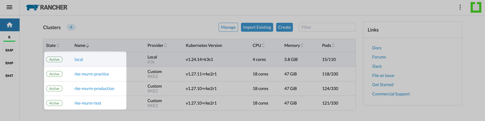
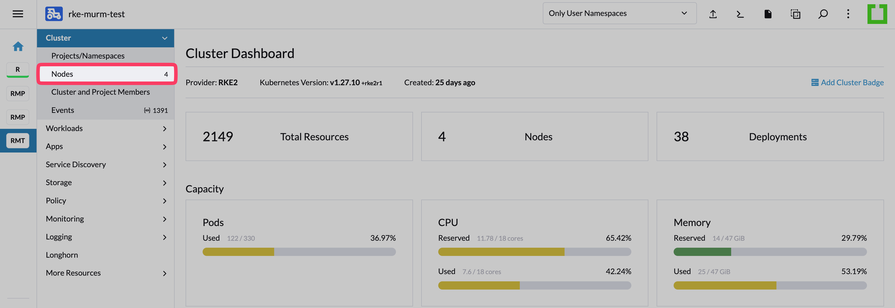
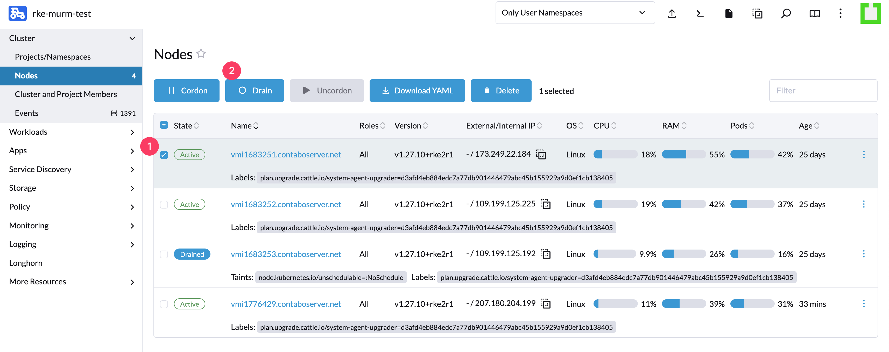
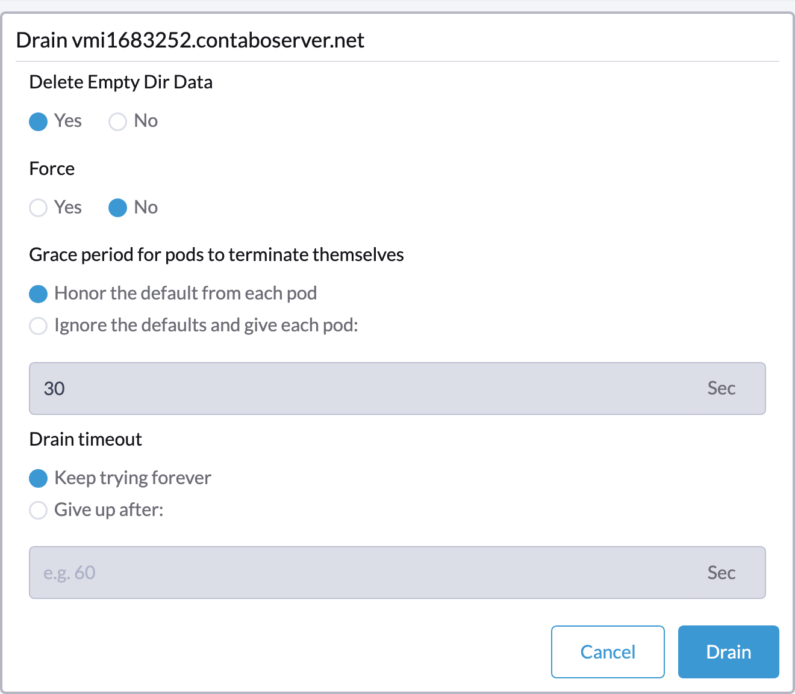
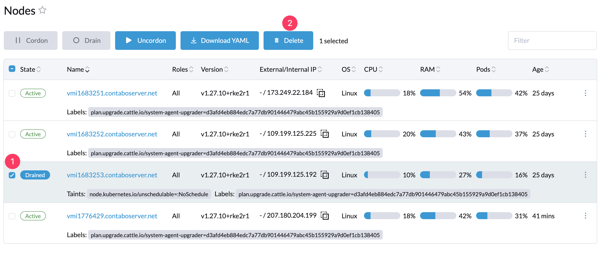

# Manage Cluster Nodes

## Introduction

This guide outlines the management of cluster nodes within Rancher. By following the document, you can effectively add and remove nodes.

## Table of Contents

- [Introduction](#introduction)
- [Prerequisites](#prerequisites)
- [Step 1 - Select Cluster](#step-1---select-cluster)
- [Step 2 - Go to Nodes Page](#step-2---go-to-nodes-page)
- [Step 3 - Select and Drain Nodes](#step-3---select-and-drain-nodes)
- [Step 4 - Remove Drained Nodes](#step-4---remove-drained-nodes)
- [Conclusion](#conclusion)

## Prerequisites

- Before starting, add new nodes to your cluster, matching the number you plan to drain, to ensure the total node count remains unchanged.

## Step 1 - Select Cluster

Navigate to the Rancher homepage and choose the cluster you wish to manage.

## Step 2 - Go to Nodes Page

From the cluster homepage, access the nodes section via the left sidebar.

## Step 3 - Select and Drain Nodes

On the Nodes page, identify and select the nodes for drainage, then click "Drain".

Choose "Delete Empty Dir Data" and confirm by clicking "Drain".

## Step 4 - Remove Drained Nodes

Following successful drainage, eliminate the drained nodes from the Cluster Management page.

## Conclusion

This guide provides a streamlined approach to managing cluster nodes within Rancher, ensuring operational efficiency and reliability.

Go back to [Home](../README.md).
