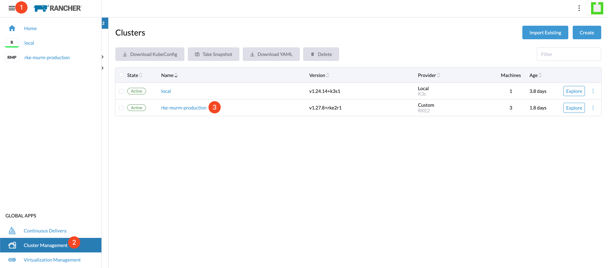
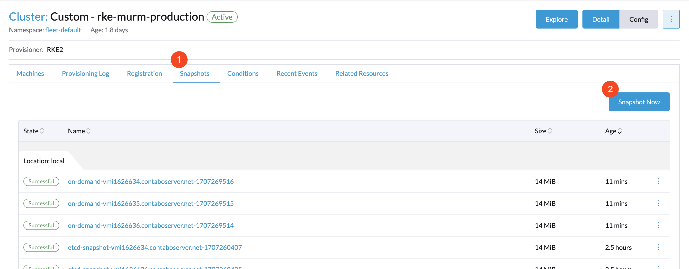
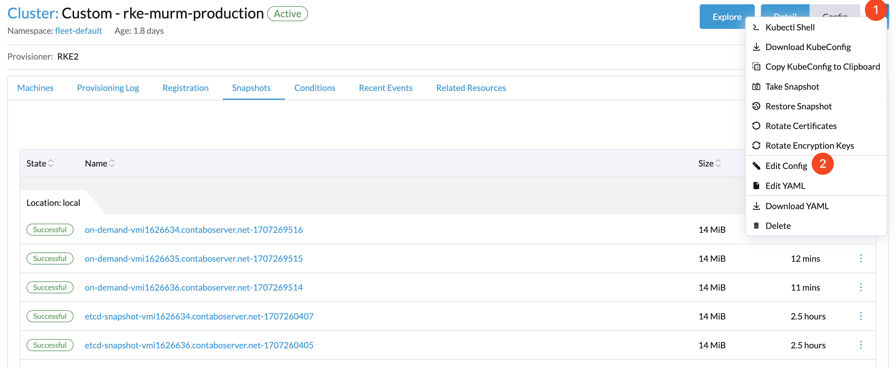
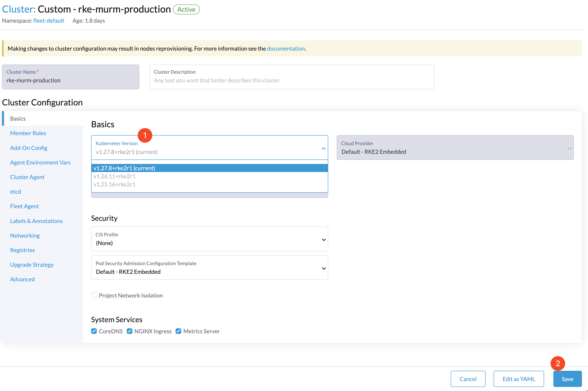
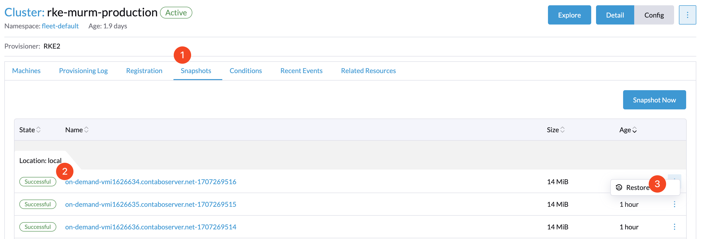
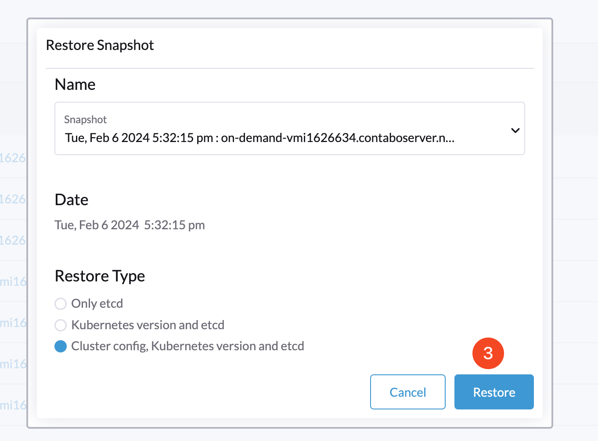

# Upgrading RKE2 Clusters with Rancher

## Introduction

This document outlines a structured approach for upgrading Kubernetes versions in clusters managed by Rancher. The upgrade process is critical for leveraging the latest features, performance enhancements, and security patches in Kubernetes ecosystems.

## Table of Contents

- [Introduction](#introduction)
- [Prerequisites](#prerequisites)
- [Step 1 - Accessing Cluster Management](#step-1---accessing-cluster-management)
- [Step 2 - Initiating a Cluster Snapshot](#step-2---initiating-a-cluster-snapshot)
- [Step 3 - Modifying Cluster Configuration](#step-3---modifying-cluster-configuration)
- [Step 4 - Updating the Kubernetes Version](#step-4---updating-the-kubernetes-version)
- [Optional - Restoring to a Previous State](#optional---restoring-to-a-previous-state)
- [Conclusion](#conclusion)

## Prerequisites

Prior to initiating the upgrade, ensure the following conditions are met:

- You have administrative privileges on the Rancher platform.

## Step 1 - Accessing Cluster Management

Navigate to the **☰** menu in the upper left corner of the Rancher dashboard. Select **Cluster Management** and proceed to the cluster designated for upgrade.

## Step 2 - Initiating a Cluster Snapshot

Within the cluster management interface, locate and select the **Snapshots** tab, followed by **Snapshot Now** to create a backup.

## Step 3 - Modifying Cluster Configuration

In the Cluster Management area, click on the **...** menu in the upper right corner and choose **Edit Config** to modify cluster settings.

## Step 4 - Updating the Kubernetes Version

Adjust the cluster's configuration as follows:

1. Find the **Kubernetes Version** dropdown menu.
2. Select the Kubernetes version to which you intend to upgrade.
3. Confirm the selection by clicking **Save**, initiating the upgrade process as Rancher applies the new Kubernetes version to your cluster.

## Optional - Restoring to a Previous State

If the upgrade process encounters issues or you decide to revert to the previous Kubernetes version, you can easily restore your cluster to its prior state using the snapshot taken in Step 2. To restore:

1. Navigate back to the **Cluster Management** page.
2. Click on the **Snapshots** tab.
3. Locate the snapshot you created before initiating the upgrade.
4. Click on the **Restore** button next to the snapshot.

This action will revert the cluster to its state at the time of the snapshot, ensuring minimal disruption and downtime.

## Conclusion

By adhering to these instructions, you can efficiently upgrade the Kubernetes version of your Rancher-managed cluster. This procedure is engineered to be clear and user-friendly, assuring that your clusters remain up-to-date with the most secure and capable version of Kubernetes available. Rancher simplifies the management and upgrading of Kubernetes clusters, enabling you to concentrate on application deployment and management.
