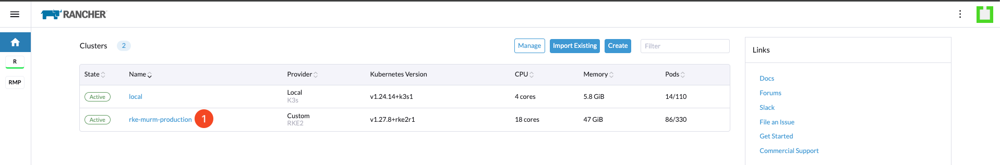
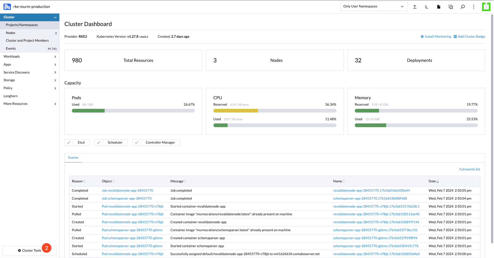
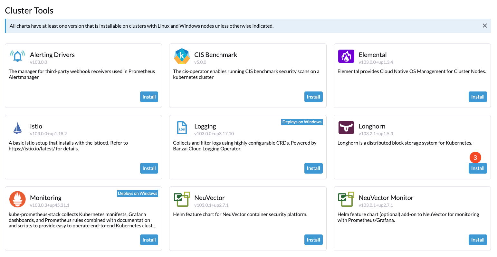
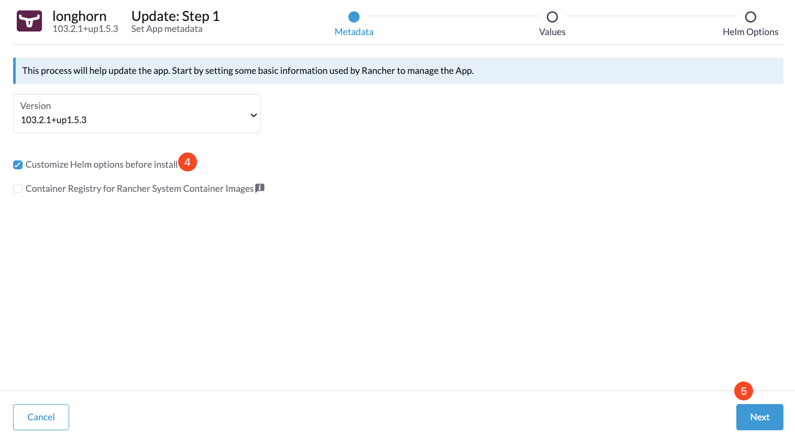
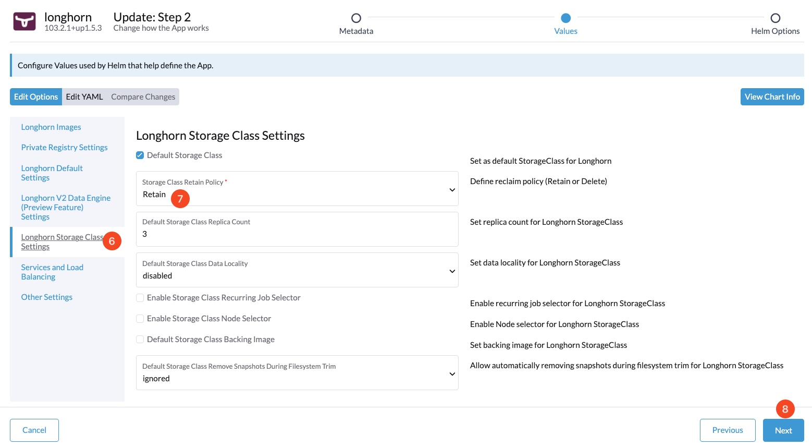
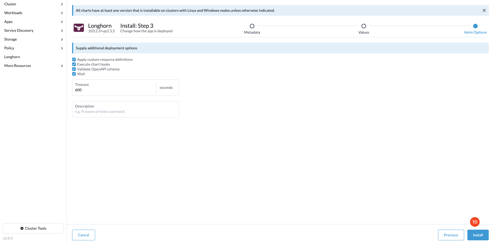

# Setting Up Longhorn for RKE2 Using Rancher

## Introduction

This guide will walk you through the process of installing and setting up Longhorn, a distributed block storage system for Kubernetes, on your RKE2 cluster using the Rancher dashboard. The steps include installing Longhorn from the Rancher Cluster Tools and configuring its options to suit your needs.

By the end of this guide, you will be able to:

- Install Longhorn from the Rancher dashboard.
- Customize Longhorn’s Helm chart options.
- Configure Longhorn settings according to your storage requirements.

## Table of Contents

- [Introduction](#introduction)
- [Prerequisites](#prerequisites)
- [Step 1 - Installing Longhorn](#step-1---installing-longhorn)
- [Step 2 - Customizing Helm Options](#step-2---customizing-helm-options)
- [Step 3 - Configuring Longhorn Settings](#step-3---configuring-longhorn-settings)
- [Conclusion](#conclusion)

## Prerequisites

Ensure you have completed the following before proceeding:

- Access to the Rancher dashboard.
- An RKE2 cluster deployed and accessible via Rancher.
- Familiarity with Kubernetes storage concepts.

## Step 1 - Installing Longhorn

To install Longhorn, navigate to the Cluster Tools section of your Rancher dashboard.

From the **Home Page**, click on the cluster where you want to install Longhorn.

From the **Cluster Dashboard**, click on the **Cluster Tools** button.

In the **Cluster Tools** page, find the Longhorn card and click on the **Install** button.

## Step 2 - Customizing Helm Options

After initiating the Longhorn installation, you will be directed to the Helm chart options for Longhorn.

Check the option to **Customize Helm options before install**. and Click the **Next** button to proceed to Helm chart customization.

## Step 3 - Configuring Longhorn Settings

You will now be able to configure various settings for Longhorn to tailor it to your cluster's storage needs.

The **Longhorn Storage Class** Settings allow you to set defaults for your storage class. It is recommended to set the StorageClass Reclaim Policy to **Retain** for persistent volume data safety.

After adjusting the settings to your preference, click on the Next button to proceed to the final step.

Review the Helm chart options and provide a description if necessary. Confirm the settings and click on the **Install** button to complete the Longhorn setup.

## Conclusion

With Longhorn installed and configured, your RKE2 cluster is now equipped with a robust, distributed block storage system. Longhorn facilitates easy storage management and high availability for your Kubernetes workloads. You can now deploy applications that require persistent storage with confidence, knowing that Longhorn is managing your data.

Go to Section 7 - [Run Murmuration Services](../07-run-murmuration-services/README.md).
