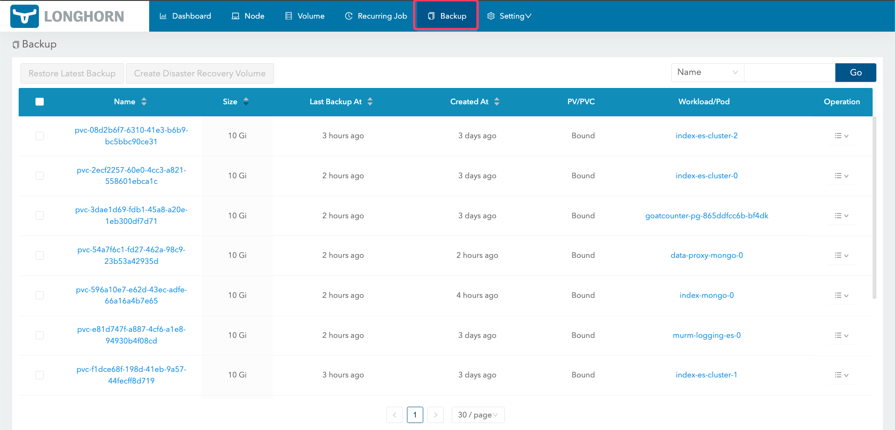
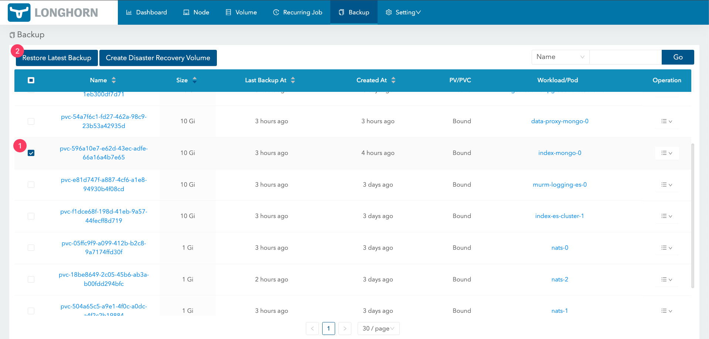
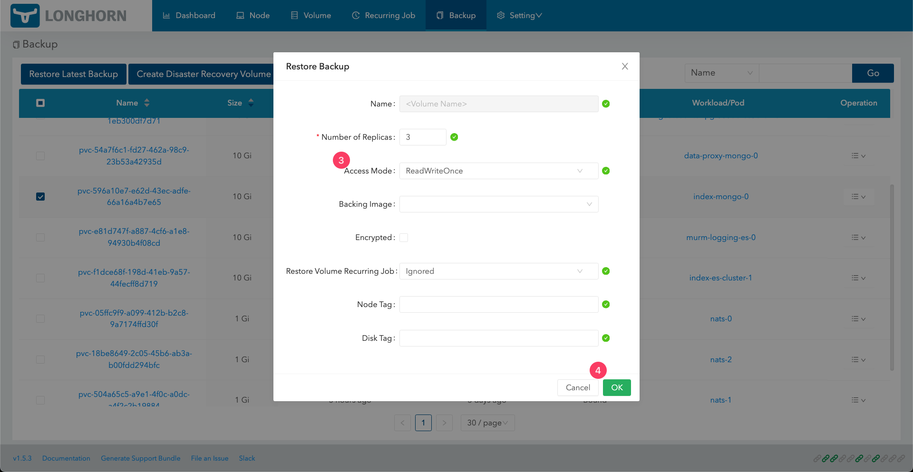
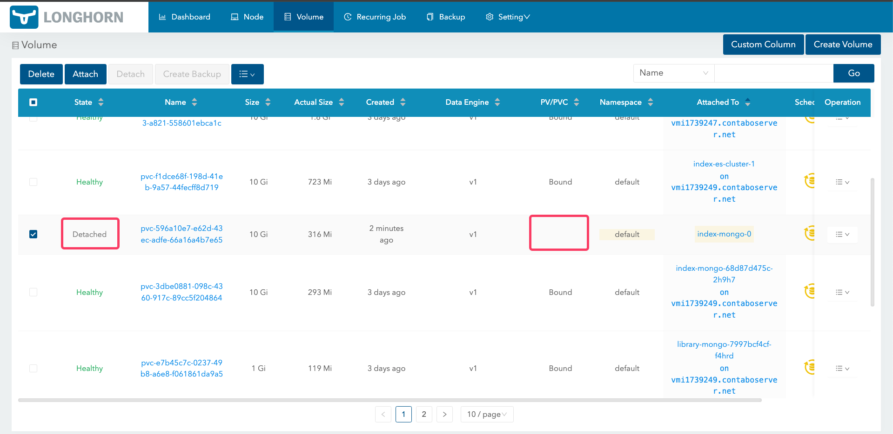
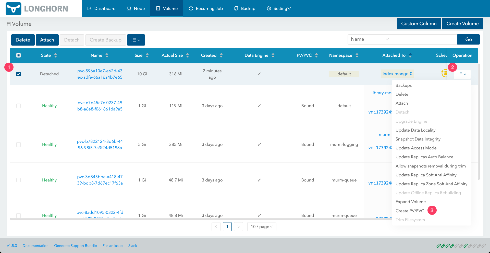
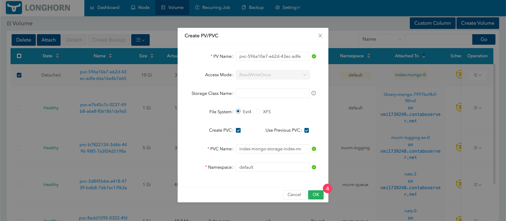
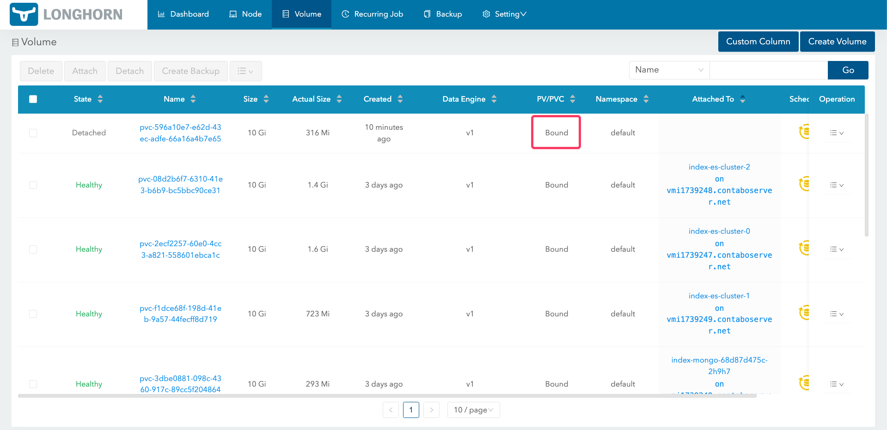
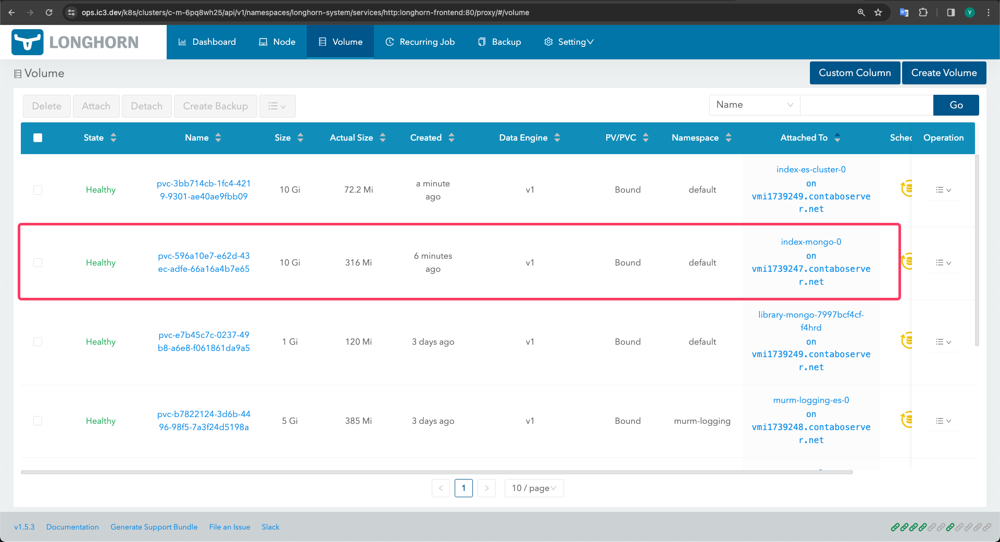

# Recover from Backup

## Introduction

This document provides a detailed guide on how to recover your data from backups using Longhorn. It is designed to help users restore their services and volumes efficiently.

## Table of Contents

- [Introduction](#introduction)
- [Step 1 - Access the Longhorn Backup Page](#step-1---access-the-longhorn-backup-page)
- [Step 2 - Recover Backups](#step-2---recover-backups)
- [Step 3 - Bind Volumes](#step-3---bind-volumes)
- [Step 4 - Deploy Services](#step-4---deploy-services)

## Step 1 - Access the Longhorn Backup Page

Navigate to the Longhorn backup page to see a comprehensive list of all available backups.



## Step 2 - Recover Backups

1. Navigate to the Backup tab.

2. Select the backups you wish to recover.

Note: If you want to recover an entire service, you must choose all the related backups.



3. For "Recovery Options", select "Read-Write" mode, then click "OK".



## Step 3 - Bind Volumes

First, navigate to the Volumes tab.

Initially, the volume's state will be "Detached", and PV/PVC will be empty.



Create PV and PVC for the backup by selecting the backup and clicking "Create PV/PVC".



Click "OK".



The PV/PVC section of the volume will then become "Bound".



If you have multiple volumes to recover, please repeat the process for each one.

## Step 4 - Deploy Services

Switch to the correct Kubernetes context:

```bash
kubectl config use-context {{k8s-context}}
```

Ensure the service you wish to recover is not running. You can uninstall the service using Helm:

```bash
helm uninstall {{service-name}}
```

Redeploy the service, and the volume will be mounted automatically.

```bash
make manually-deploy-{{service-name}} DEPLOY_ENV={{env}}
```


