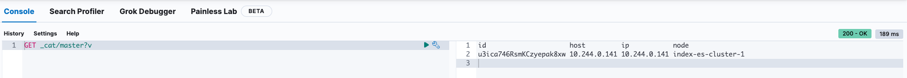

# Migrate Elasticsearch

## Introduction

This document provides a detailed guide for migrating Elasticsearch data across different environments.

Upon completing this guide, you will have:

- Successfully migrated Elasticsearch data.

## Table of Contents

- [Introduction](#introduction)
- [Prerequisites](#prerequisites)
- [Step 1 - Connect to Source Kubernetes Cluster](#step-1---connect-to-source-kubernetes-cluster)
- [Step 2 - Access Kibana on Source](#step-2---access-kibana-on-source)
- [Step 3 - Identify the Master Node on Source](#step-3---identify-the-master-node-on-source)
- [Step 4 - Connect to the Master Node on Source](#step-4---connect-to-the-master-node-on-source)
- [Step 5 - Configure Elasticsearch on Source](#step-5---configure-elasticsearch-on-source)
- [Step 6 - Reload Secure Settings on Source](#step-6---reload-secure-settings-on-source)
- [Step 7 - Create Snapshot Repository on Source](#step-7---create-snapshot-repository-on-source)
- [Step 8 - Create Snapshot on Source](#step-8---create-snapshot-on-source)
- [Step 9 - Switch to Destination Kubernetes Cluster](#step-9---switch-to-destination-kubernetes-cluster)
- [Step 10 - Access Kibana on Destination](#step-10---access-kibana-on-destination)
- [Step 11 - Identify the Master Node on Destination](#step-11---identify-the-master-node-on-destination)
- [Step 12 - Connect to the Master Node on Destination](#step-12---connect-to-the-master-node-on-destination)
- [Step 13 - Configure Elasticsearch on Destination](#step-13---configure-elasticsearch-on-destination)
- [Step 14 - Reload Secure Settings on Destination](#step-14---reload-secure-settings-on-destination)
- [Step 15 - Create Snapshot Repository on Destination](#step-15---create-snapshot-repository-on-destination)
- [Step 16 - Restore Data on Destination](#step-16---restore-data-on-destination)
- [Conclusion](#conclusion)

## Prerequisites

Before starting, ensure you have:

1. Administrative access to both source and destination Kubernetes clusters.
2. Necessary credentials and access keys for Elasticsearch secure settings.

## Step 1 - Connect to Source Kubernetes Cluster

Connect to the source Kubernetes cluster:

```bash
kubectl config use-context do-lon1-murmprod
```

## Step 2 - Access Kibana on Source

Open another terminal tab and establish port forwarding to access Kibana:

```bash
kubectl port-forward svc/index-kibana 5601:5601
```

## Step 3 - Identify the Master Node on Source

Visit [http://localhost:5601/app/dev_tools#/console](http://localhost:5601/app/dev_tools#/console) and execute the following command:

```bash
GET _cat/master?v
```



## Step 4 - Connect to the Master Node on Source

Open another terminal tab and connect to the master node:

```bash
kubectl exec -it index-es-cluster-1 -- bash
```

## Step 5 - Configure Elasticsearch on Source

Add your access and secret keys to the Elasticsearch keystore:

```bash
ACCESS_KEY='<YOUR_ACCESS_KEY>'
echo $ACCESS_KEY | /usr/share/elasticsearch/bin/elasticsearch-keystore add --stdin s3.client.default.access_key

SECRET_KEY='<YOUR_SECRET_KEY>'
echo $SECRET_KEY | /usr/share/elasticsearch/bin/elasticsearch-keystore add --stdin s3.client.default.secret_key
```


## Step 6 - Reload Secure Settings on Source

Reload secure settings to apply the new configuration in Kibana:

```bash
POST _nodes/reload_secure_settings
```


## Step 7 - Create Snapshot Repository on Source

Define a snapshot repository with your storage details:

```bash
DELETE /_snapshot/contabo_space
PUT /_snapshot/contabo_space
{
  "type": "s3",
  "settings": {
    "bucket": "es-backup-production",
    "endpoint": "eu2.contabostorage.com",
    "region": "EU",
    "path_style_access": "true"
  }
}
```


## Step 8 - Create Snapshot on Source

Initiate a snapshot of the desired indices:

```bash
PUT /_snapshot/contabo_space/my_snapshot
{
  "indices": "nodes",
  "ignore_unavailable": true,
  "include_global_state": false
}
```


**Note**: Now that you have created a snapshot for your source Elasticsearch, the following steps 9 to 15 essentially repeat the above process for the target Elasticsearch.

## Step 9 - Switch to Destination Kubernetes Cluster

Switch your Kubernetes context to the destination cluster:

```bash
kubectl config use-context rke-murm-production
```

## Step 10 - Access Kibana on Destination

Establish port forwarding to access Kibana in the destination environment:

```bash
kubectl port-forward svc/index-kibana 5601:5601
```

## Step 11 - Identify the Master Node on Destination

Visit [http://localhost:5601/app/dev_tools#/console](http://localhost:5601/app/dev_tools#/console) and execute the following command:

```bash
GET _cat/master?v
```


## Step 12 - Connect to the Master Node on Destination

Connect to the destination's master node for configuration:

```bash
kubectl exec -it index-es-cluster-1 -- bash
```

## Step 13 - Configure Elasticsearch on Destination

Repeat the process of adding access and secret keys to the Elasticsearch keystore:

```bash
ACCESS_KEY='<YOUR_ACCESS_KEY>'
echo $ACCESS_KEY | /usr/share/elasticsearch/bin/elasticsearch-keystore add --stdin s3.client.default.access_key

SECRET_KEY='<YOUR_SECRET_KEY>'
echo $SECRET_KEY | /usr/share/elasticsearch/bin/elasticsearch-keystore add --stdin s3.client.default.secret_key
```


## Step 14 - Reload Secure Settings on Destination

Reload secure settings to apply the new configuration in Kibana:

```bash
POST _nodes/reload_secure_settings
```


## Step 15 - Create Snapshot Repository on Destination

Create the same snapshot repository configuration on the destination:

```bash
PUT /_snapshot/contabo_space
{
  "type": "s3",
  "settings": {
    "bucket": "es-backup-production",
    "endpoint": "eu2.contabostorage.com",
    "region": "EU",
    "path_style_access": "true",
    "protocol": "https"
  }
}
```


## Step 16 - Restore Data on Destination

Finally, restore the snapshot to the destination Elasticsearch cluster:

```bash
# Perform the operation if you have node indexes before.
DELETE /nodes

POST /_snapshot/contabo_space/my_snapshot/_restore
{
  "indices": "nodes",
  "ignore_unavailable": true,
  "include_global_state": false
}
```

## Conclusion

Following these steps, you have successfully migrated your Elasticsearch data, ensuring seamless transition and data integrity across environments.
