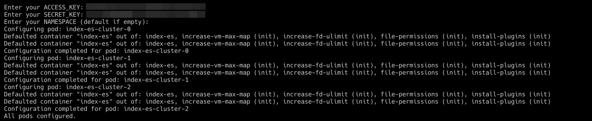
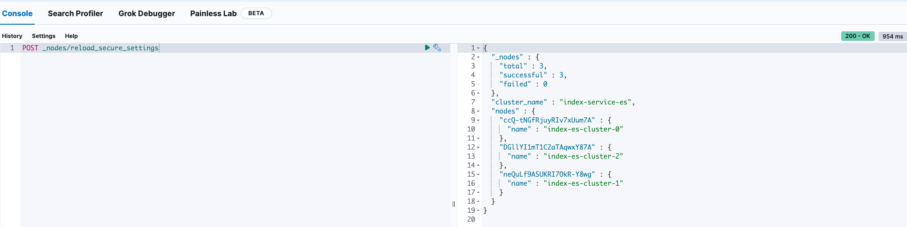
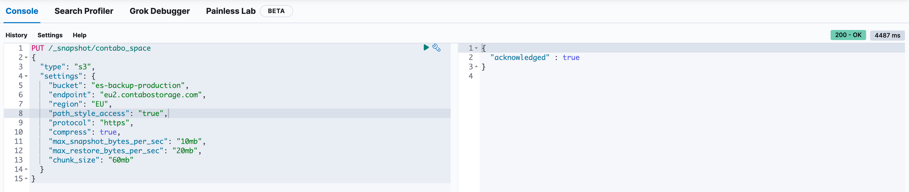
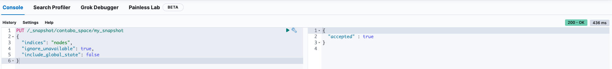
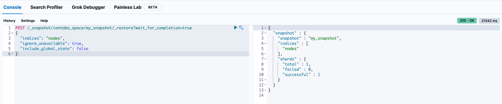
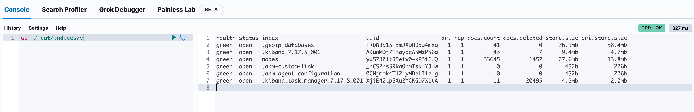

# Migrate Elasticsearch

## Introduction

This document provides a detailed guide for migrating Elasticsearch data across different environments.

Upon completing this guide, you will have:

- Successfully migrated Elasticsearch data.

## Table of Contents

- [Introduction](#introduction)
- [Prerequisites](#prerequisites)
- [Step 1 - Connect to Source Kubernetes Cluster](#step-1---connect-to-source-kubernetes-cluster)
- [Step 2 - Configure Elasticsearch on Source](#step-2---configure-elasticsearch-on-source)
- [Step 3 - Access Kibana on Source](#step-3---access-kibana-on-source)
- [Step 4 - Reload Secure Settings on Source](#step-4---reload-secure-settings-on-source)
- [Step 5 - Create Snapshot Repository on Source](#step-5---create-snapshot-repository-on-source)
- [Step 6 - Create Snapshot on Source](#step-6---create-snapshot-on-source)
- [Step 7 - Switch to Destination Kubernetes Cluster](#step-7---switch-to-destination-kubernetes-cluster)
- [Step 8 - Configure Elasticsearch on Destination](#step-8---configure-elasticsearch-on-destination)
- [Step 9 - Access Kibana on Destination](#step-9---access-kibana-on-destination)
- [Step 10 - Reload Secure Settings on Destination](#step-10---reload-secure-settings-on-destination)
- [Step 11 - Create Snapshot Repository on Destination](#step-11---create-snapshot-repository-on-destination)
- [Step 12 - Restore Data on Destination](#step-12---restore-data-on-destination)
- [Step 13 - Check Indices](#step-13---check-indices)
- [Conclusion](#conclusion)

## Prerequisites

Before starting, ensure you have:

1. Administrative access to both source and destination Kubernetes clusters.
2. Necessary credentials and access keys for Elasticsearch secure settings.

## Step 1 - Connect to Source Kubernetes Cluster

Connect to the source Kubernetes cluster:

```bash
kubectl config use-context do-lon1-murmprod
```

## Step 2 - Configure Elasticsearch on Source

Execute the configuration script for Elasticsearch and replace `ACCESS_KEY` and `SECRET_KEY` with your own.

```bash
curl -s https://raw.githubusercontent.com/MurmurationsNetwork/MurmurationsServices/main/scripts/configure_es_s3.sh | bash -s -- ACCESS_KEY SECRET_KEY
```



## Step 3 - Access Kibana on Source

Open another terminal tab and establish port forwarding to access Kibana:

```bash
kubectl port-forward svc/index-kibana 5601:5601
```

## Step 4 - Reload Secure Settings on Source

Visit [http://localhost:5601/app/dev_tools#/console](http://localhost:5601/app/dev_tools#/console) and execute the following command to reload secure settings.

```bash
POST _nodes/reload_secure_settings
```



## Step 5 - Create Snapshot Repository on Source

Define a snapshot repository with your storage details:

```bash
PUT /_snapshot/contabo_space
{
  "type": "s3",
  "settings": {
    "bucket": "es-backup-production",
    "endpoint": "eu2.contabostorage.com",
    "region": "EU",
    "path_style_access": "true",
    "protocol": "https",
    "compress": true,
    "max_snapshot_bytes_per_sec": "10mb",
    "max_restore_bytes_per_sec": "20mb",
    "chunk_size": "60mb"
  }
}
```



## Step 6 - Create Snapshot on Source

Initiate a snapshot of the desired indices:

```bash
PUT /_snapshot/contabo_space/my_snapshot?wait_for_completion=true
{
  "indices": "nodes",
  "ignore_unavailable": true,
  "include_global_state": false
}
```



## Step 7 - Switch to Destination Kubernetes Cluster

Switch your Kubernetes context to the destination cluster:

```bash
kubectl config use-context rke-murm-production
```

## Step 8 - Configure Elasticsearch on Destination

Execute the configuration script for Elasticsearch and replace `ACCESS_KEY` and `SECRET_KEY` with your own.

```bash
curl -s https://raw.githubusercontent.com/MurmurationsNetwork/MurmurationsServices/main/scripts/configure_es_s3.sh | bash -s -- ACCESS_KEY SECRET_KEY
```


## Step 9 - Access Kibana on Destination

Establish port forwarding to access Kibana in the destination environment:

```bash
kubectl port-forward svc/index-kibana 5601:5601
```

## Step 10 - Reload Secure Settings on Destination

Visit [http://localhost:5601/app/dev_tools#/console](http://localhost:5601/app/dev_tools#/console) and execute the following command to reload secure settings.

```bash
POST _nodes/reload_secure_settings
```


## Step 11 - Create Snapshot Repository on Destination

Create the same snapshot repository configuration on the destination:

```bash
PUT /_snapshot/contabo_space
{
  "type": "s3",
  "settings": {
    "bucket": "es-backup-production",
    "endpoint": "eu2.contabostorage.com",
    "region": "EU",
    "path_style_access": "true",
    "protocol": "https",
    "compress": true,
    "max_snapshot_bytes_per_sec": "10mb",
    "max_restore_bytes_per_sec": "20mb",
    "chunk_size": "60mb"
  }
}
```


## Step 12 - Restore Data on Destination

Restore the snapshot to the destination Elasticsearch cluster:

```bash
# Delete existing indices if necessary.
DELETE /nodes

# Restore the snapshot.
POST /_snapshot/contabo_space/my_snapshot/_restore?wait_for_completion=true
{
  "indices": "nodes",
  "ignore_unavailable": true,
  "include_global_state": false
}
```



## Step 13 - Check Indices

Verify the indices on the destination cluster:

```bash
GET /_cat/indices?v
```



## Conclusion

Following these steps, you have successfully migrated your Elasticsearch data, ensuring seamless transition and data integrity across environments.
