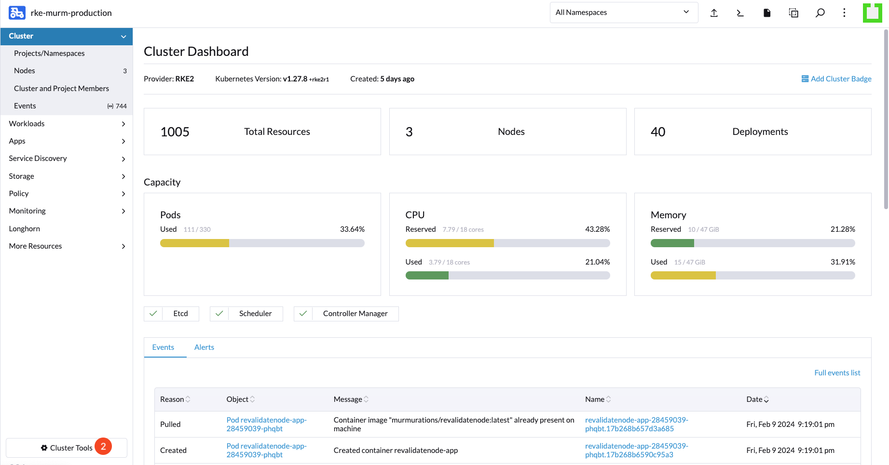
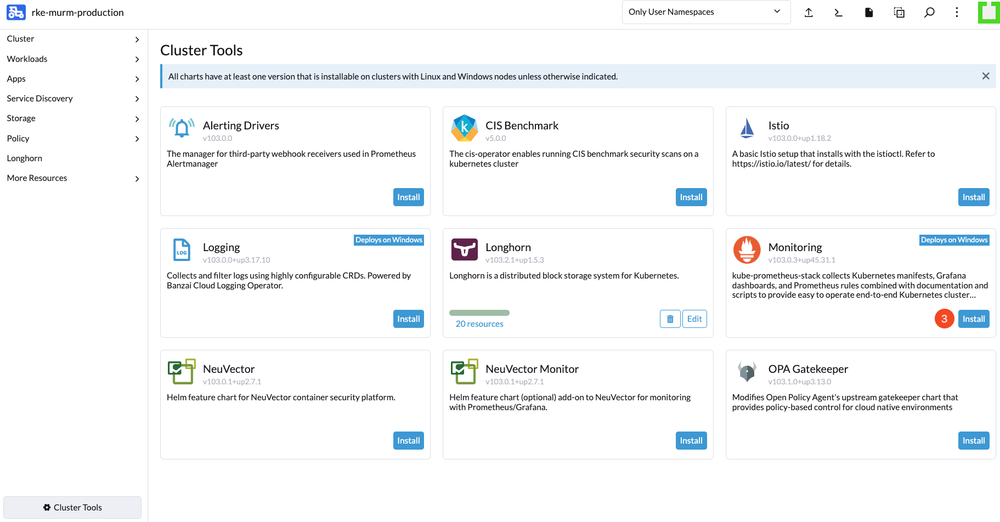
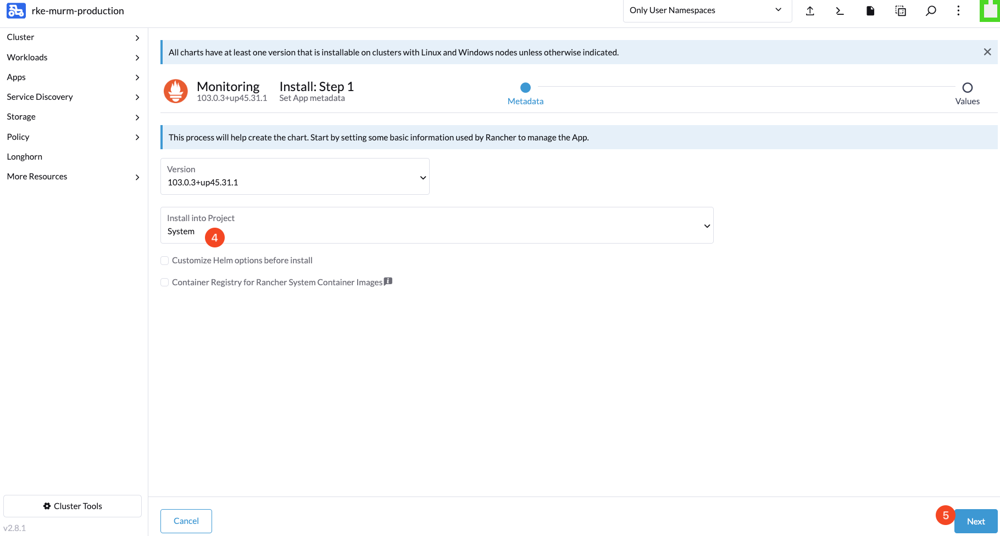
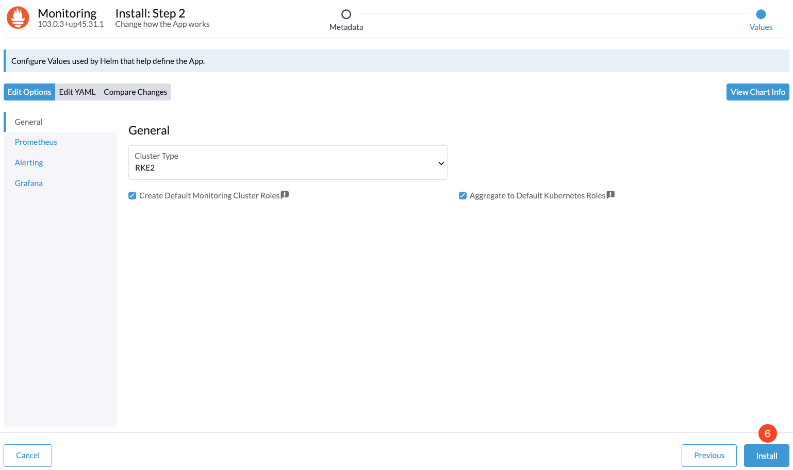
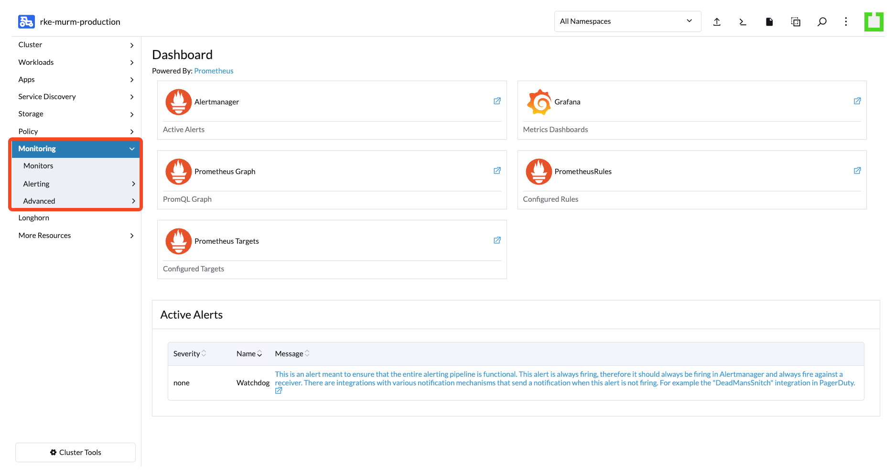

# Setting Up Monitoring for RKE2 Cluster

## Introduction

This guide will walk you through the process of installing and configuring Monitoring tools using Rancher. By the end of this setup, you'll have comprehensive insights into the performance and health of your clusters.

## Table of Contents

- [Introduction](#introduction)
- [Prerequisites](#prerequisites)
- [Step 1 - Selecting Your Cluster](#step-1---selecting-your-cluster)
- [Step 2 - Accessing Cluster Tools](#step-2---accessing-cluster-tools)
- [Step 3 - Installing the Monitoring Tool](#step-3---installing-the-monitoring-tool)
- [Step 4 - Verifying Installation Settings](#step-4---verifying-installation-settings)
- [Step 5 - Finalizing the Installation](#step-5---finalizing-the-installation)
- [Step 6 - Locating the Monitoring Tab](#step-6---locating-the-monitoring-tab)
- [Conclusion](#conclusion)

## Prerequisites

Before beginning, confirm that you have:

1. Administrative access to the Rancher dashboard.
2. An active RKE2 cluster with no current issues or outages.

## Step 1 - Selecting Your Cluster

Log into your Rancher dashboard and choose the cluster you intend to monitor.

## Step 2 - Accessing Cluster Tools

On your cluster’s overview page, locate and enter the `Cluster Tools` menu, which lists various utilities available for your cluster.

## Step 3 - Installing the Monitoring Tool

Find the `Monitoring` section in the Cluster Tools menu. Begin the installation process by clicking on the `Install` button associated with the Monitoring tool.

## Step 4 - Verifying Installation Settings

Confirm the version of the Monitoring tool is appropriate for your cluster setup. Choose the `System` project or another specific project where the Monitoring tool should be deployed.

## Step 5 - Finalizing the Installation

Review all settings to ensure they are correct and meet your cluster’s needs. Once you are satisfied, proceed by clicking the `Install` button to apply your configuration and finalize the Monitoring tool installation.

## Step 6 - Locating the Monitoring Tab

After installation, you can find the Monitoring tab in the sidebar of your cluster’s overview page, where you can monitor and manage your cluster's metrics.

## Conclusion

You have now equipped your RKE2 cluster with the tools necessary for effective monitoring.

Go to Section 9 - [Set Up Logging](../09-setup-logging/README.md).
