# Setting Up Logging

## Introduction

This guide will walk you through the process of setting up logging for your environment using Elasticsearch and Kibana. By the end of this tutorial, you will have a powerful logging system in place, enabling efficient log management and analysis.

## Table of Contents

- [Introduction](#introduction)
- [Prerequisites](#prerequisites)
- [Step 1 - Navigate to the Desired Cluster](#step-1---navigate-to-the-desired-cluster)
- [Step 2 - Select Cluster Tools](#step-2---select-cluster-tools)
- [Step 3 - Install Logging Tool](#step-3---install-logging-tool)
- [Step 4 - Project Selection and Installation](#step-4---project-selection-and-installation)
- [Step 5 - Verifying Logging Tool Sidebar](#step-5---verifying-logging-tool-sidebar)
- [Step 6 - Installing Elasticsearch and Kibana](#step-6---installing-elasticsearch-and-kibana)
- [Step 7 - Checking Installation Status](#step-7---checking-installation-status)
- [Step 8 - Configuring Logging Output](#step-8---configuring-logging-output)
- [Step 9 - Adding Log Flow](#step-9---adding-log-flow)
- [Step 10 - Validation of Flow and Output](#step-10---validation-of-flow-and-output)
- [Step 11 - Accessing the Kibana Console](#step-11---accessing-the-kibana-console)
- [Step 12 - Updating Index Type](#step-12---updating-index-type)
- [Step 13 - Go to Data Views Management](#step-13---go-to-data-views-management)
- [Step 14 - Configuring Index Patterns](#step-14---configuring-index-patterns)
- [Step 15 - Navigating to Discover in Kibana](#step-15---navigating-to-discover-in-kibana)
- [Conclusion](#conclusion)

## Prerequisites

Before starting, ensure you have:

1. Command-line access to your system.
2. Administrative privileges on the system.
3. The `kubectl` command-line tool configured for your cluster.

## Step 1 - Navigate to the Desired Cluster

Navigate to the desired cluster in your Rancher dashboard to begin the logging tool installation process.

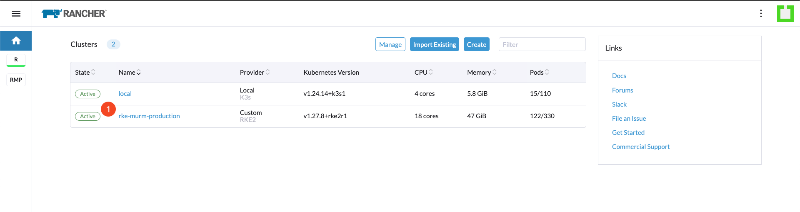

## Step 2 - Select Cluster Tools

In the Rancher dashboard, select the "Cluster Tools" option to access the available logging tools for installation.

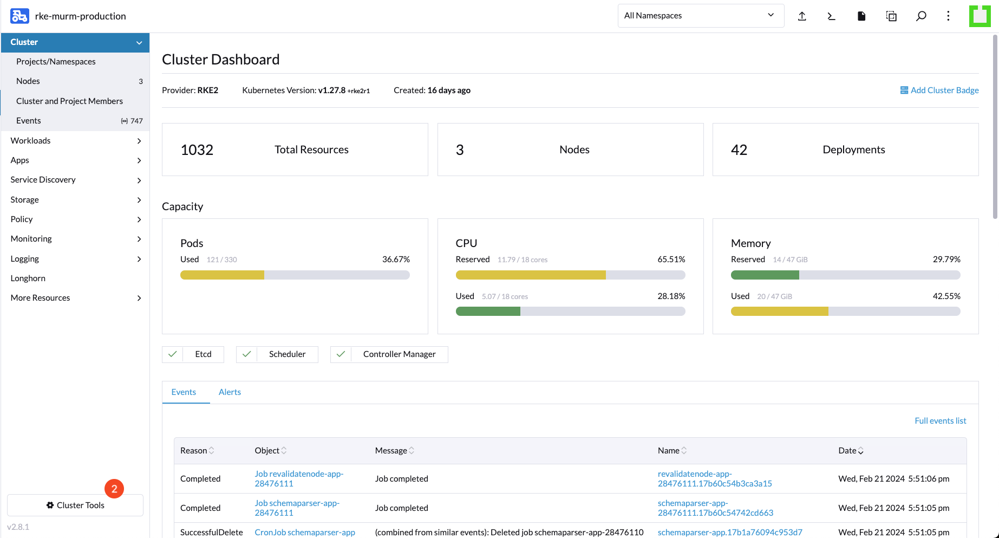

## Step 3 - Install Logging Tool

Choose the logging tool you wish to install and click "Install".

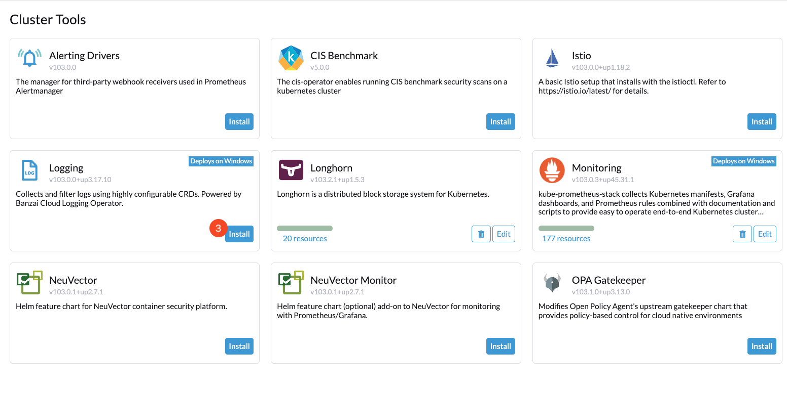

## Step 4 - Project Selection and Installation

Install in the "System" project, then click "Next".

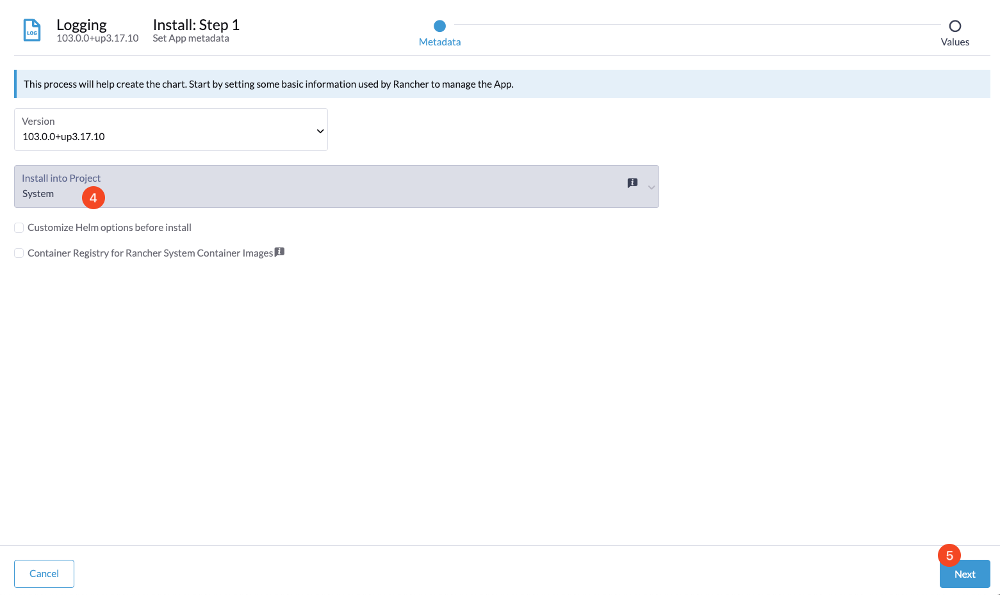

Confirm the installation by clicking "Install".

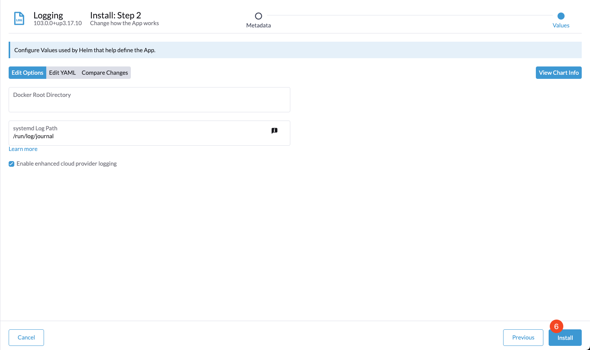

## Step 5 - Verifying Logging Tool Sidebar

Upon successful installation, the logging tool's tab will appear in the Rancher sidebar, indicating the tool is ready for configuration.

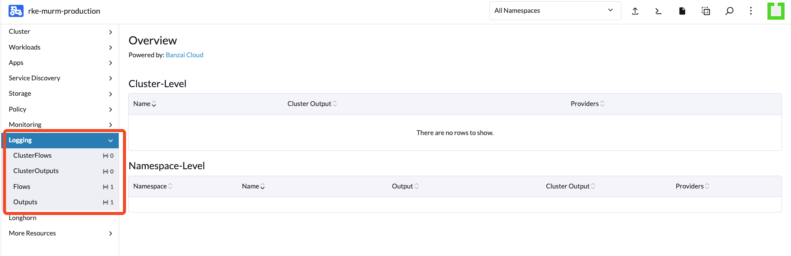

## Step 6 - Installing Elasticsearch and Kibana

Deploy Elasticsearch and Kibana in your cluster by executing the provided command. This step sets up the core components for your logging system.

```bash
make manually-deploy-murm-logging DEPLOY_ENV=production
```

## Step 7 - Checking Installation Status

Verify that the logging components are correctly deployed by checking the status of the pods within the `murm-logging` namespace.

```bash
kubectl get pods -n murm-logging
```

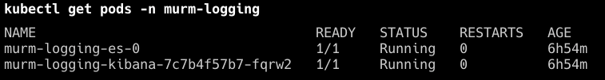

## Step 8 - Configuring Logging Output

Configure the logging output in Rancher to specify where logs should be sent, using the provided YAML configuration for Elasticsearch.

Go back to Rancher and navigate to the output configuration section.

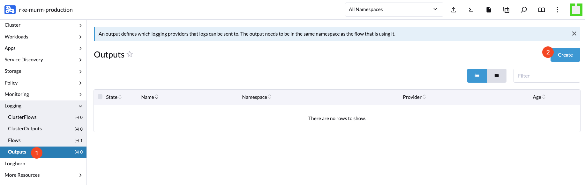

Select "Edit as YAML" and paste the provided configuration.

```yaml
apiVersion: logging.banzaicloud.io/v1beta1
kind: Output
metadata:
  name: elasticsearch-output
  namespace: default
spec:
  elasticsearch:
    host: murm-logging-es.murm-logging.svc.cluster.local
    index_name: murm-logs-%Y.%m.%d
    port: 9200
    scheme: http
    buffer:
      timekey: '1m'
      timekey_wait: '30s'
      size: '8m'
      queue_limit_length: 256
      overflow_action: block
```

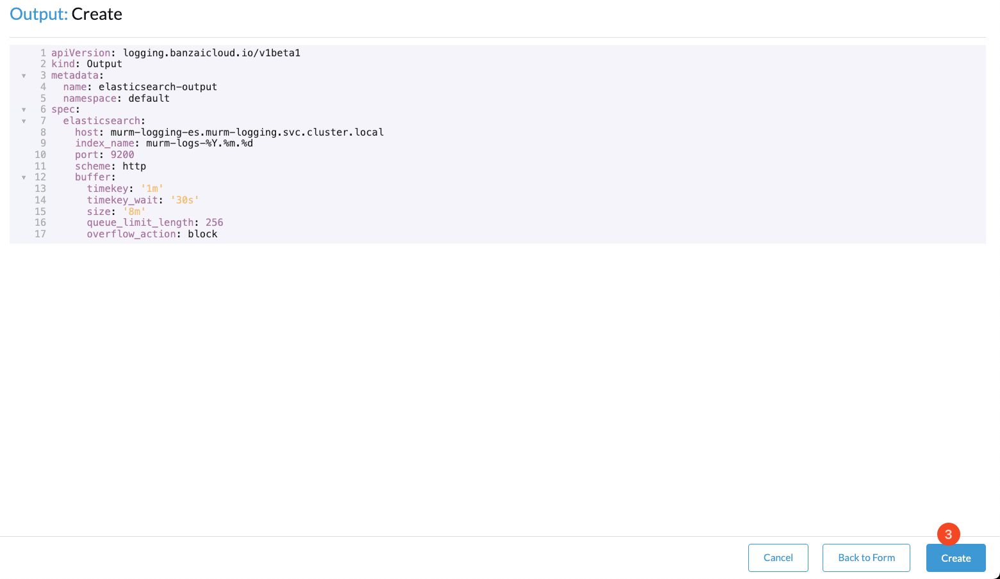

## Step 9 - Adding Log Flow

Create a flow to manage how logs are processed and directed within your system, using the provided YAML configuration.

Navigate to the flow tab and initiate the creation of a new log flow.

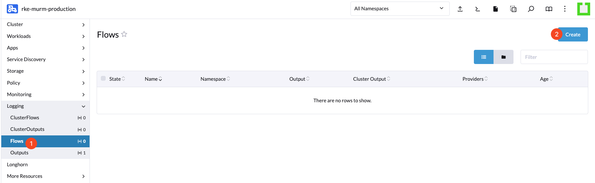

Click "Edit as YAML" and insert the provided configuration.

```yaml
apiVersion: logging.banzaicloud.io/v1beta1
kind: Flow
metadata:
  name: murm-services-flow
  namespace: default
spec:
  filters:
    - tag_normaliser:
        format: '${namespace_name}.${pod_name}.${container_name}'
    - parser:
        parse:
          type: json
          time_key: time
          time_format: '%Y-%m-%dT%H:%M:%S.%LZ'
          keep_time_key: true
          utc: true
    - geoip:
        geoip_lookup_keys: ip
        records:
          - geo: >-
              '{"type": "Point", "coordinates": [${location.longitude["ip"]}, ${location.latitude["ip"]}]}'
          - country: '${country.iso_code["ip"]}'
          - region: '${subdivisions.0.iso_code["ip"]}'
          - city: '${city.names.en["ip"]}'
  localOutputRefs:
    - elasticsearch-output
  match:
    - select:
        labels:
          log-group: murm
```

## Step 10 - Validation of Flow and Output

Validate the configuration by checking the status of the flow and output in your cluster to ensure they are correctly set up.

```bash
kubectl get flow && kubectl get output
```

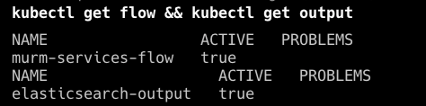

## Step 11 - Accessing the Kibana Console

Access the Kibana console by forwarding a local port to the Kibana service in your cluster.

```bash
kubectl port-forward -n murm-logging svc/murm-logging-kibana 5601:5601
```

Navigate to `http://localhost:5601/app/dev_tools#/console` in your browser to update index type.

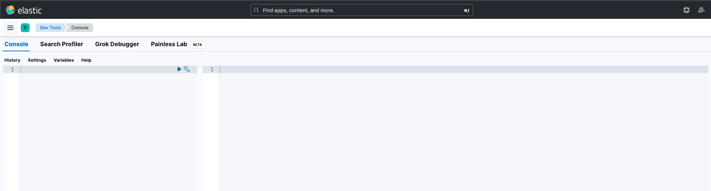

## Step 12 - Updating Index Type

Copy and paste the following into the console and execute them one by one. The goal is to tell Elasticsearch that the geo field is not just a simple JSON data type but a geo_shape.

```text
PUT _component_template/geo_component_template
{
  "template": {
    "mappings": {
      "properties": {
        "geo": {
          "type": "geo_shape"
        }
      }
    }
  }
}

PUT _index_template/murm_logs_template
{
  "index_patterns": ["murm-logs-*"],
  "template": {
    "settings": {
      "number_of_shards": 1
    }
  },
  "composed_of": ["geo_component_template"]
}
```

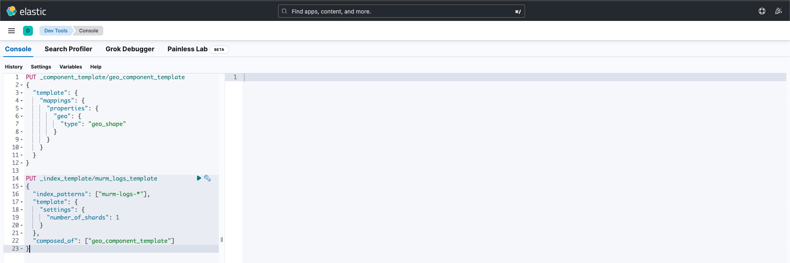

## Step 13 - Go to Data Views Management

Navigate to `http://localhost:5601/app/management/kibana/dataViews` in your browser to configure index patterns.

## Step 14 - Configuring Index Patterns

If you follow the guide and configure correctly, the above page should indicate that "You have data in Elasticsearch." Proceed by clicking on "Create data view."

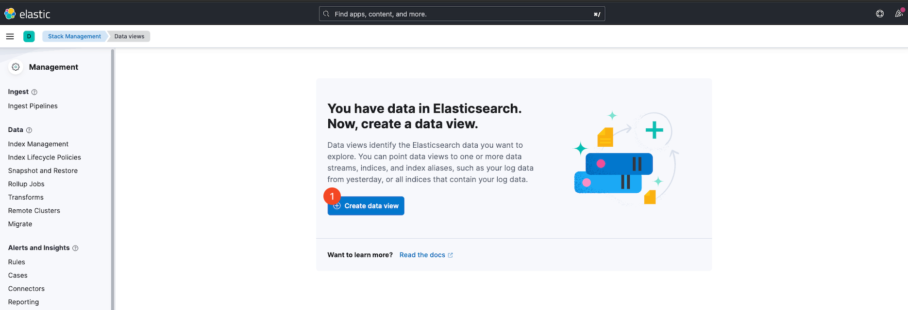

Configure index patterns in Kibana as shown in the image and click "Save."

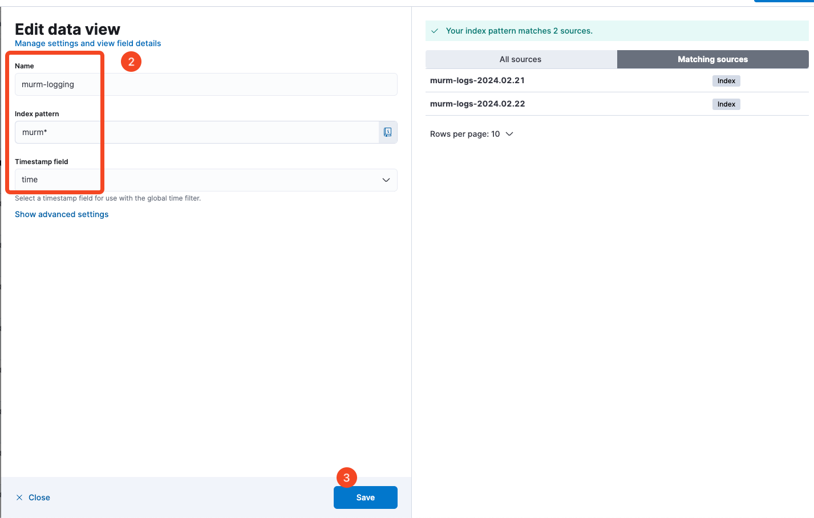

## Step 15 - Navigating to Discover in Kibana

Explore your logs in Kibana by navigating to the "Discover" section, where you can search and analyze logged events.


Now you should see the logging showing up.

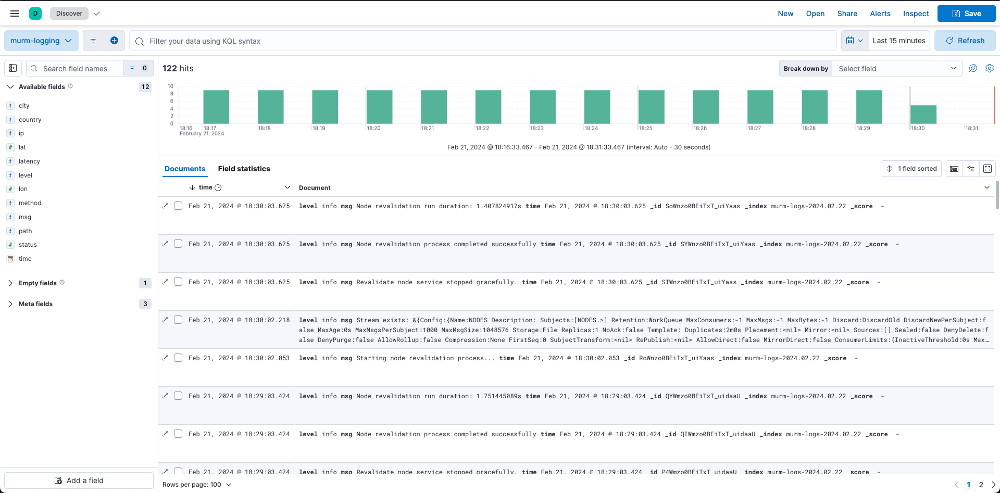

## Conclusion

You've now successfully set up a logging system with Elasticsearch and Kibana in your cluster. This system will aid in the aggregation, analysis, and visualization of logs, providing valuable insights into your system's operations.

Go back to [Home](../README.md).
