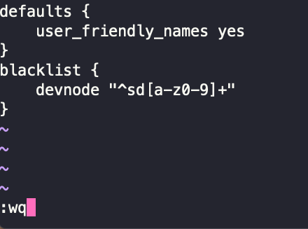
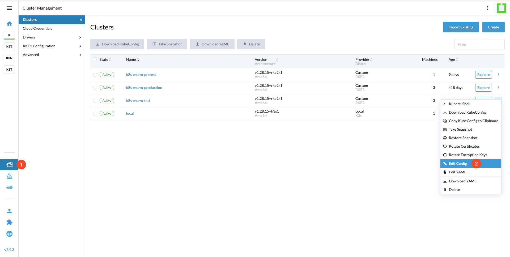
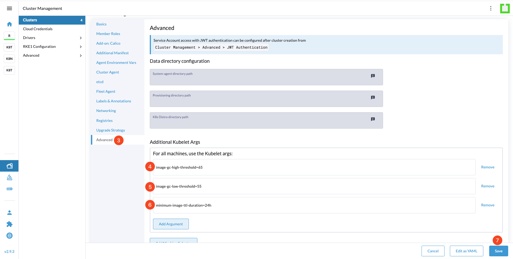
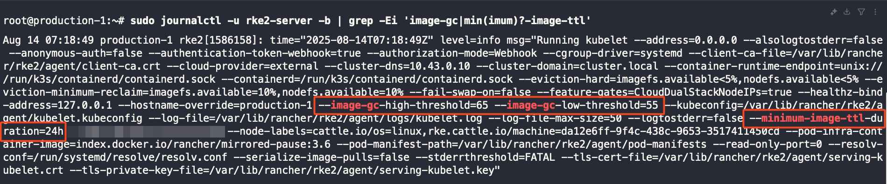

# Setup Kubelet Image Cleanup

## Table of Contents

- [Background](#background)
- [Prerequisites](#prerequisites)
- [Step 1 - Fix Longhorn Multipath Issue](#step-1---fix-longhorn-multipath-issue)
- [Step 2 - Configure Kubelet Image GC Parameters via Rancher UI](#step-2---configure-kubelet-image-gc-parameters-via-rancher-ui)
- [Step 3 - Verify the Configuration on the Node](#step-3---verify-the-configuration-on-the-node)
- [Conclusion](#conclusion)

## Background

Over time, Kubernetes nodes accumulate unused container images, which can lead to disk space shortages and cause pod scheduling or startup failures.
Kubelet has a built-in Image Garbage Collection mechanism that automatically removes unused images when certain thresholds are reached. By updating Kubelet settings, you can control when this cleanup occurs.

## Prerequisites

1. Administrator access to Rancher UI
2. The target cluster is managed by Rancher
3. Confirmation that rolling updates to Kubelet settings will not impact critical workloads

## Step 1 - Fix Longhorn Multipath Issue

Before configuring Kubelet settings in Rancher UI, we need to address a known issue where Kubelet configuration changes can cause [Longhorn to encounter multipath problems](https://longhorn.io/kb/troubleshooting-volume-with-multipath/).

To prevent this issue, connect to all nodes in your cluster and configure multipath settings:

1. SSH into each node in your cluster:

   ```bash
   ssh root@your-node-ip
   ```

2. Edit the multipath configuration file:

   ```bash
   sudo vi /etc/multipath.conf
   ```

3. By default, the file will contain:

   ```bash
   defaults {
       user_friendly_names yes
   }
   ```

4. Update the configuration to include a blacklist section:

   ```bash
   defaults {
       user_friendly_names yes
   }
   blacklist {
       devnode "^sd[a-z0-9]+"
   }
   ```

5. Save and exit the file using `:wq`

    

6. Repeat this process for **all nodes** in your cluster before proceeding to the next step.

## Step 2 - Configure Kubelet Image GC Parameters via Rancher UI

1. In **Rancher UI**, go to **Cluster Management**, select your cluster, then choose **Edit Config**.
    
2. Once in the config interface, click on **Advanced**, then in the **Additional Kubelet Args** section, click **Add Argument** and add the following parameters:

   ```bash
   image-gc-high-threshold=65
   image-gc-low-threshold=55
   minimum-image-ttl-duration=24h
   ```

3. Click **Save** to apply the configuration.
    
4. Wait for the nodes to roll out and apply the new configuration.

### Parameter Explanation

- **image-gc-high-threshold=65**: This sets the disk usage threshold at which image garbage collection begins. With a total disk capacity of 150GB and 45GB reserved space in Longhorn, the system would crash if usage exceeds 105GB. Setting this to 65% (approximately 100GB) ensures cleanup starts before reaching critical levels.
- **image-gc-low-threshold=55**: This sets the target disk usage level that garbage collection aims to reach. Once cleanup begins at 65%, it will continue removing unused images until disk usage drops to 55% (approximately 80GB in our system).
- **minimum-image-ttl-duration=24h**: This parameter ensures that images are not deleted until they have been unused for at least 24 hours, preventing the removal of recently used images that might be needed again soon.

## Step 3 - Verify the Configuration on the Node

1. SSH into the any node in the cluster.

2. Run the following command to check if the settings have been applied:

   ```bash
   sudo journalctl -u rke2-server -b | grep -Ei 'image-gc|min(imum)?-image-ttl'
   ```

3. If the output shows the parameters you configured in Step 2, then the configuration has been successfully applied. You should see output similar to the image below:
   

## Conclusion

You have successfully configured kubelet image garbage collection for your cluster. This automated cleanup process will help prevent disk space issues and maintain cluster stability without manual intervention.

Go back to [Home](../README.md).
