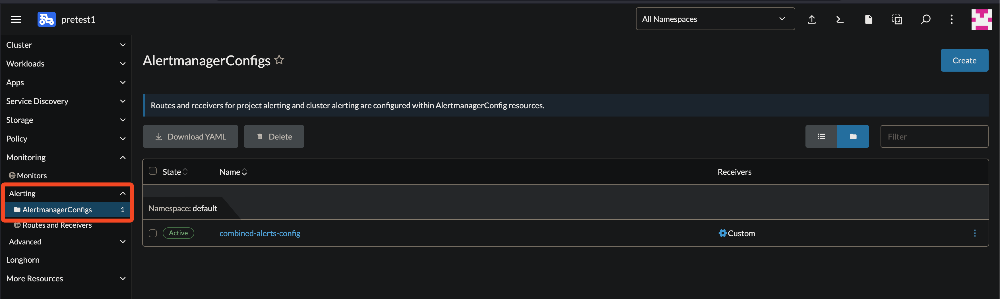
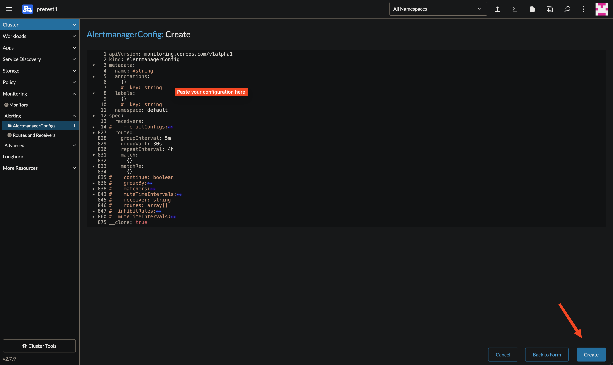

# How to Send an Alert to Telegram

## Steps to Configure Alerts

**1. Create a Secret in the Desired Namespace**

   Use the following command to create a secret for the Telegram bot token in your Kubernetes cluster:

   ```bash
   kubectl create secret generic telegram-bot-token-secret --from-literal=bot-token=<bot-token> --namespace=default
   ```

**2. Access Your Kubernetes Cluster Dashboard**

   - Select your cluster on the left sidebar.

   

**3. Navigate to Monitoring**

   - Click "Monitoring."

   

**4. Configure Alertmanager**

   - Click "Alert" and choose "Alertmanager Config."
   - Click "Create."

   
   

**5. Edit the Configuration**

   - Click "Edit as YAML."

   

**6. Enter Your Configuration**

   - Paste your configuration into the editor.
   - Click "Save."

   

## Example YAML Configuration

Here is an example of a YAML file to configure Alertmanager for sending alerts to Telegram:

```yaml
apiVersion: monitoring.coreos.com/v1alpha1
kind: AlertmanagerConfig
metadata:
  # Sets the namespace where this configuration is applied.
  namespace: default
spec:
  # Defines rules to suppress notifications under certain conditions.
  inhibitRules:
    # If there is an alert with the name "InfoInhibitor" in a given namespace,
    # then suppress (do not send notifications for) all other alerts that have a
    # severity level of "info" in the same namespace.
    - equal:
        - namespace
      sourceMatch:
        - matchType: '='
          name: alertname
          value: InfoInhibitor
      targetMatch:
        - matchType: '='
          name: severity
          value: info
  # Defines where notifications should be sent.
  receivers:
    - name: 'null' # A receiver with no action.
    - name: telegram-alerts
      telegramConfigs:
        - apiURL: https://api.telegram.org # Telegram API URL
          botToken:
            key: bot-token
            name: telegram-bot-token-secret # secret name
            optional: false # Indicates the token is mandatory.
          chatID: "telegram-chat-id"
          disableNotifications: false
          message: >-
            {{ range .Alerts }}{{ .Annotations.summary }}: {{ .Annotations.description }}\n{{ end }}
          parseMode: Markdown
          sendResolved: true
  # Defines routing tree for alert notifications.
  route:
   # Criteria for grouping alerts.
    groupBy:
      - alertname
      - severity
    groupInterval: 5m
    groupWait: 30s
    # Default receiver for alerts.
    receiver: telegram-alerts
    repeatInterval: 4h
    # Additional routes for specific alerts.
    routes:
      - continue: true # Allows further processing if the match is successful
        matchers:
          - matchType: '='
            name: alertname
            value: CPUThrottlingHigh
        receiver: telegram-alerts
      - continue: true
        matchers:
          - matchType: '='
            name: alertname
            value: NodeDown
        receiver: telegram-alerts
      # Don't send InfoInhibitor and Watchdog alerts to telegram-alerts.
      - matchers:
          - matchType: '=~'
            name: alertname
            value: InfoInhibitor|Watchdog
        receiver: 'null'
```

For more information on configuring the Alertmanager, you can refer to this [OpenShift Documentation](https://docs.openshift.com/container-platform/4.11/rest_api/monitoring_apis/alertmanagerconfig-monitoring-coreos-com-v1beta1.html).
