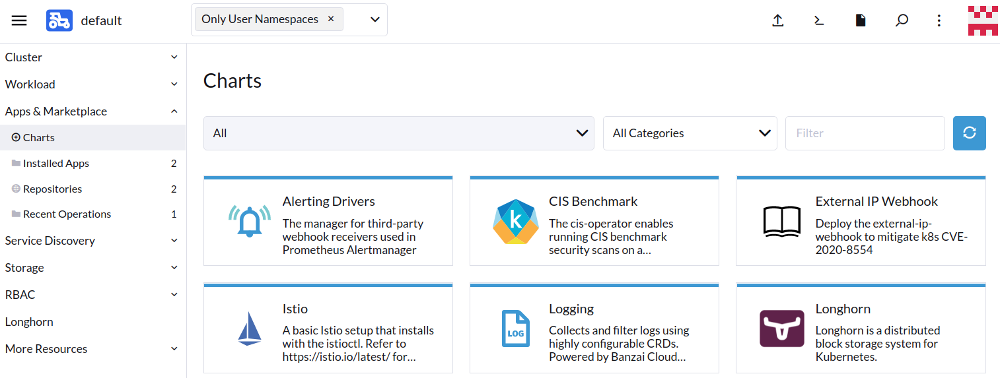

# Installing Longhorn with Rancher

Source: [Install as a Rancher Apps & Marketplace](https://longhorn.io/docs/1.5.3/deploy/install/install-with-rancher/)

1. Navigate to your cluster and select "Apps".
2. Choose "Charts" and then find and select "Longhorn".

3. In the Metadata section, select "Customize Helm options before install".
4. Proceed by clicking "Next".
5. Click "Longhorn Storage Class Settings".
6. Set the Storage Class Retain Policy to "Retain".
7. Finalize the installation by clicking "Install".
