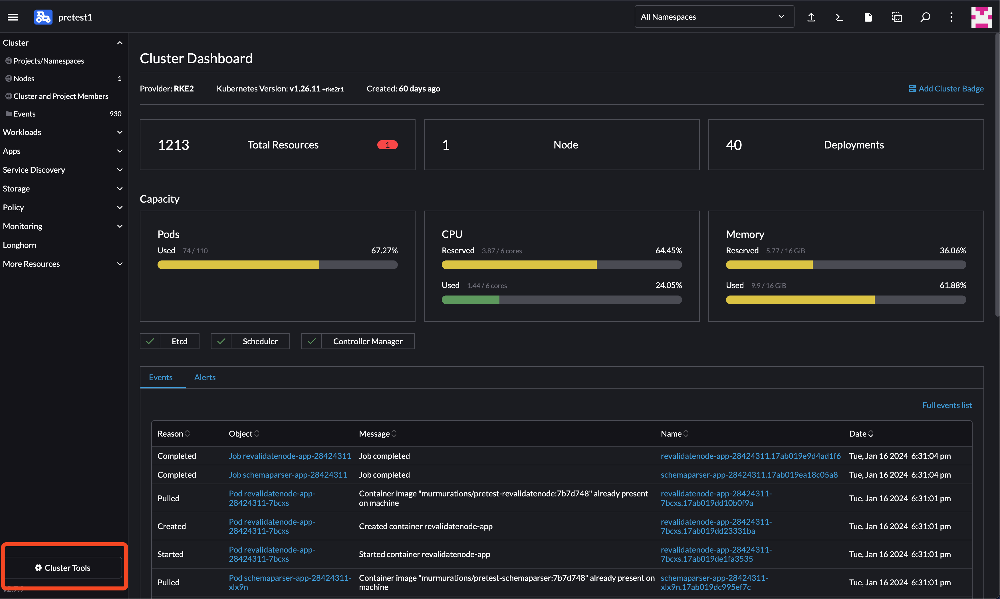
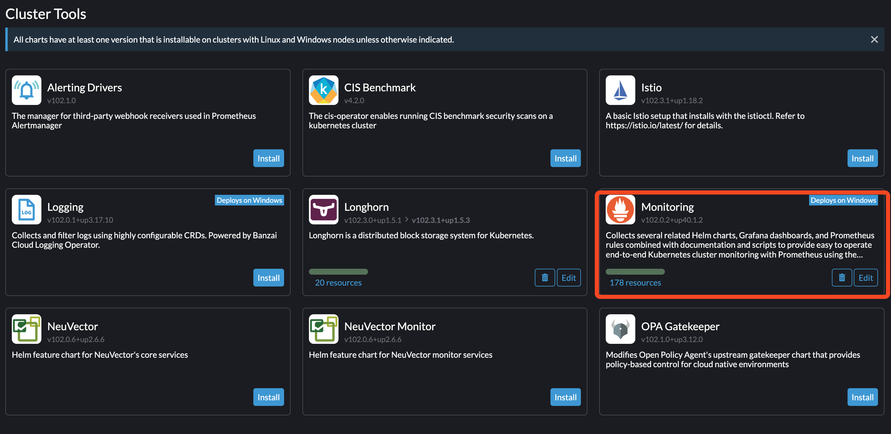

# How to Install Monitoring in a Kubernetes Cluster Using Rancher

This guide provides step-by-step instructions for installing monitoring tools in a Kubernetes cluster managed by Rancher.

## Steps

1. **Select the Desired Cluster:**

   From the Rancher dashboard, identify and click on the cluster you wish to monitor from the left sidebar.

   

2. **Access the Cluster Dashboard:**

   Once you have selected your cluster, navigate to the cluster dashboard. Here, you'll find various management and configuration options.

3. **Install Monitoring Tools:**

   In the cluster dashboard, look for the "Cluster Tools" section. Here, you'll find the Monitoring tool. Click on the "Monitoring" option and proceed to install it.

   

   
