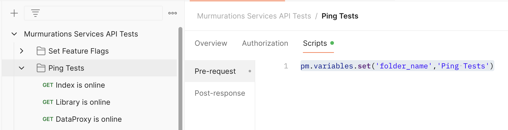

# Improve Postman Output

To make the Postman output more readable and parsable when reviewing test results, we need to update the Postman script for each folder containing E2E tests.

1. When you create a new test folder, add the following code to 'Pre-request script' and replace 'TYPE_IN_FOLDER_NAME' with the new folder name.

   ```javascript
   pm.variables.set('folder_name','TYPE_IN_FOLDER_NAME');
   ```



The output will look like this:


This makes it easier to identify the test results for a specific folder.
